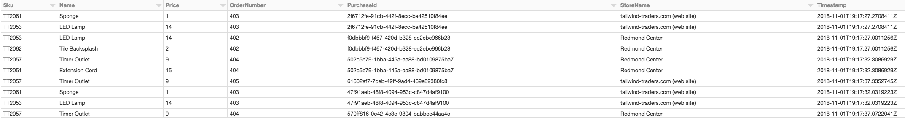
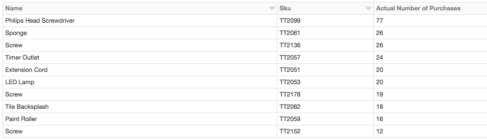

# Code Walkthrough

This step by step guide is intended for the code to be run in a Notebook attached to Apache Spark cluster running on Azure Databricks.

## General notes

### Programming language

The code is written in Scala, one of the languages supported by Apache Spark on Azure Databricks. Another language supported is Python. In this case choice to use Scala was made because it is the primary language used while interacting with Apache Spark, which is itself written in Scala. While adoption of Python with Apache Spark is constantly growing, majority of online examples and articles on Apache Spark use Scala.

### Running the code

You can import the Notebook by downloading `DataProcessing.dbc` and attaching it to Azure Databricks cluster. For the code to run successfully, there are some [prerequisites](../README.md) you would need to check first. Each sell in attached Notebook can be executed with `Shift+Enter`.

## Step by step guide

The Notebook starts with retrieving values of secrets [previously defined](../../Data-ingestion-and-processing/README.md#233-install-databricks-cli-create-a-secret-store-and-initialize-secret-values) in Databricks Secret Store.

```scala
// Secrets are stored in Databricks Secret Store
// Use Databricks CLI: https://docs.databricks.com/user-guide/dev-tools/databricks-cli.html

// Create a secret scope:
// databricks secrets create-scope --scope tailwind-traders --initial-manage-principal users

// Create secrets:
// databricks secrets put --scope tailwind-traders --key <somekey>

val eventHubsConnection = dbutils.secrets.get(scope = "tailwind-traders", key = "eventhubsConnection")
val azureFunction = dbutils.secrets.get(scope = "tailwind-traders", key = "azureFunction")
val cosmosDbHost = dbutils.secrets.get(scope = "tailwind-traders", key = "cosmosDbHost")
val cosmosDbKey = dbutils.secrets.get(scope = "tailwind-traders", key = "cosmosDbKey")
```

All the secret values defined above can now be referenced using `s"${secretValue}"`, but their real values won't be displayed in console logs and will show as `[REDACTED]` instead.

First step for processing data is to receive data from Event Hubs. We need to make sure the Spark connector for Event Hubs library is attached to the Azure Databricks cluster, and import it. Apache Spark supports receiving streams of events from variety of sources, and to start receiving data from Event Hubs we use `spark.readStream` function passing `eventhubs` as expected format and specifying Event Hubs connection string.

To view what the expected schema of incoming data is `printSchema` is a useful function. `isStreaming` is used to verify that the source system is active.

```scala
import org.apache.spark.eventhubs._

val customEventhubParameters = EventHubsConf(s"${eventHubsConnection}").setMaxEventsPerTrigger(5)

val incomingStream = spark.readStream.format("eventhubs").options(customEventhubParameters.toMap).load()

incomingStream.printSchema
incomingStream.isStreaming
```

The output of this code would be similar to this:

```txt
root
 |-- body: binary (nullable = true)
 |-- partition: string (nullable = true)
 |-- offset: string (nullable = true)
 |-- sequenceNumber: long (nullable = true)
 |-- enqueuedTime: timestamp (nullable = true)
 |-- publisher: string (nullable = true)
 |-- partitionKey: string (nullable = true)
 |-- properties: map (nullable = true)
 |    |-- key: string
 |    |-- value: string (valueContainsNull = true)
```

There are several fields, however `body` is the actual field where message payload resides. We are receiving data from IoT Hub, the payload of which is binary and needs to be converted to some data format we can work with.

What should this format be: JSON, XML, CSV, custom format, anything else? We can find out when we convert the message payload from binary to string:

```scala
val messages = incomingStream.selectExpr("cast (body as string) AS messageContent")
```

To see the incoming stream of events, let's use console as a sink and append new events to the console:

```scala
// Sending the incoming stream into the console.
messages.writeStream.outputMode("append").format("console").option("truncate", false).start().awaitTermination()
```

You should see data to start appearing:

```txt
-------------------------------------------
Batch: 0
-------------------------------------------
+--------------+
|messageContent|
+--------------+
+--------------+

-------------------------------------------
Batch: 1
-------------------------------------------
+------------------------------------------+
|messageContent                            |
+------------------------------------------+
|{"OrderNumber":94,"PurchaseId":"41038dac-9448-4289-b5f3-3c57ca01dabb","StoreName":"Redmond Center","Email":"GranvilleKozey.Oberbrunner60@yahoo.com","CustomerName":"Granville Kozey","ShippingAddress":"377 Steuber Forges","Items":[{"Sku":"TT2099","Name":"Philips Head Screwdriver","Price":2},{"Sku":"TT2152","Name":"Screw","Price":7},{"Sku":"TT2099","Name":"Philips Head Screwdriver","Price":2},{"Sku":"TT2152","Name":"Screw","Price":7}],"Amount_Due":18,"Timestamp":"2018-11-01T18:51:33.5321494Z"}|
+------------------------------------------+

...

[OMITTED]
```

By default Apache Sparks operates in micro-batch fashion and will process new events in batches. Since recently Apache Spark also supports experimental Continuous Processing mode to operate in a true streaming fashion, however it doesn't support many sources and sinks yet, as well as non-trivial filtering and processing operations on streams. For this reason we stick to default processing mode in Apache Spark, so you'll see batches of events coming in each time we display data.

In the code above, value `messages` is of type `DataFrame` - the main Apache Spark data type representing a stream of data. You can think of a DataFrame as an infinite table with rows and columns.

One of the important things we can learn when displaying raw data coming from IoT Hub is what its format is. Now we can define the schema for messages and apply it to each event incoming event.

The code below defines data schema `iotSchema`, and applies it to the `messages` DataFrame.

```scala
// Data Processing
// Part 1: defining data schema and adding unique id column to the stream

import org.apache.spark.sql.types._
import org.apache.spark.sql.functions._

val iotSchema =
  StructType(
    StructField("OrderNumber", IntegerType) ::
    StructField("PurchaseId", StringType) ::
    StructField("StoreName", StringType) ::
    StructField("Email", StringType) ::
    StructField("CustomerName", StringType) ::
    StructField("ShippingAddress", StringType) ::
    StructField("Items", ArrayType(StructType(Array(
                          StructField("Sku", StringType),
                          StructField("Name", StringType),
                          StructField("Price", IntegerType)
                        )))) ::
    StructField("Amount_Due", DoubleType) ::
    StructField("Timestamp", StringType) ::
    Nil)

val data =
  messages
  .select(from_json(col("messageContent"), iotSchema).alias("data"))
  .select("data.*")

data.printSchema
```

After this the new DataFrame will have fields exactly corresponding to the defined schema:

```text
root
 |-- OrderNumber: integer (nullable = true)
 |-- PurchaseId: string (nullable = true)
 |-- StoreName: string (nullable = true)
 |-- Email: string (nullable = true)
 |-- CustomerName: string (nullable = true)
 |-- ShippingAddress: string (nullable = true)
 |-- Items: array (nullable = true)
 |    |-- element: struct (containsNull = true)
 |    |    |-- Sku: string (nullable = true)
 |    |    |-- Name: string (nullable = true)
 |    |    |-- Price: integer (nullable = true)
 |-- Amount_Due: double (nullable = true)
 |-- Timestamp: string (nullable = true)
```

To view the data stream, we can use `display` function. The table will be continuously updating with new data:

```scala
display(data)

// Alternatively, output to console in plain text
// data.writeStream.outputMode("append").format("console").option("truncate", false).start().awaitTermination()
```

The data represents purchases performed by customers and contains fields like customer name, email, shipping address, store name, and array of purchased items. What if we'd like to perform real-time data analysis on purchases? We can answer questions like, what are the most popular items purchased at each store, which store brings the most revenue, and more.

Let's _flatten_ the array of purchased items using Apache Spark `explode` function and bring each item on the same level with store it was bought from as well as `Timestamp`, `OrderNumber` and `PurchaseId` fields:

```scala
// Select only purchases

val itemsPurchased =
  data
  .select(explode(col("Items")).as("collection"), col("OrderNumber"), col("PurchaseId"), col("StoreName"), col("Timestamp"))
  .select(col("collection.*"), col("OrderNumber"), col("PurchaseId"), col("StoreName"), col("Timestamp"))

itemsPurchased.printSchema

display(itemsPurchased)
```

The schema of the `itemsPurchased` DataFrame would look like following:

```txt
root
 |-- Name: string (nullable = true)
 |-- Price: integer (nullable = true)
 |-- OrderNumber: integer (nullable = true)
 |-- PurchaseId: string (nullable = true)
 |-- StoreName: string (nullable = true)
 |-- Timestamp: string (nullable = true)
```



Apache Spark can perform groupings, aggregations, and ordering on streaming DataFrames. The code below is calculating overall count of purchases by item and sorts items by popularity:

```scala
val countOfPurchases = itemsPurchased.groupBy("Name", "Sku").agg(count("*") as "Actual Number of Purchases").orderBy(col("Actual Number of Purchases").desc)

display(countOfPurchases)

// Or alternatively output
// countOfPurchases.writeStream.outputMode("complete").format("console").option("truncate", false).start().awaitTermination()
```



Similarly, we can find out which stores generate most revenue:

```scala
val storesWithMostRevenue = itemsPurchased.groupBy("StoreName").agg(sum("Price") as "OverallRevenue").orderBy(col("OverallRevenue").desc)

display(storesWithMostRevenue)

// Or alternatively output
// storesWithMostRevenue.writeStream.outputMode("complete").format("console").option("truncate", false).start().awaitTermination()
```


Another question we might ask is - how can we measure demand for products? This could be really important to perform timely orders for new stock to never have product shortages for popular items. Let's imagine there's a table in a database that stores values that represent expected maximum number of purchases for specific products over some time window. The code below defines functions that interact with a Comsos DB `ExpectedDemand` table and can initialize it with default values, as well as read them.

```scala
import com.microsoft.azure.cosmosdb.spark.schema._
import com.microsoft.azure.cosmosdb.spark.CosmosDBSpark
import com.microsoft.azure.cosmosdb.spark.config.Config
import org.apache.spark.sql.functions._
import org.apache.spark.sql.{Row, SaveMode, SparkSession}
import scala.collection.immutable.Map

val expectedDemandWriteConfigMap = Map(
  "Endpoint" -> s"${cosmosDbHost}",
  "Masterkey" -> s"${cosmosDbKey}",
  "Database" -> "TailwindTraders",
  "Collection" -> "ExpectedDemand")
val expectedDemandWriteConfig = Config(expectedDemandWriteConfigMap)

val expectedDemandReadConfigMap = Map(
  "Endpoint" -> s"${cosmosDbHost}",
  "Masterkey" -> s"${cosmosDbKey}",
  "Database" -> "TailwindTraders",
  "Collection" -> "ExpectedDemand",
  "preferredRegions" -> "East US",
  "query_custom" -> "SELECT c.Name, c.NumberOfPurchases FROM c"
)
val expectedDemandReadConfig = Config(expectedDemandReadConfigMap)

def initializeExpectedDemandTable () = {
  val expectedPurchases = Seq(
    ("Philips Head Screwdriver", 18),
    ("Sponge", 15),
    ("Screw", 25),
    ("Timer Outlet", 16),
    ("Extension Cord", 14),
    ("LED Lamp", 11),
    ("Tile Backsplash", 8),
    ("Paint Roller", 17)
  ).toDF("Name", "NumberOfPurchases")
  expectedPurchases.show(false)
  expectedPurchases.write.mode(SaveMode.Overwrite).cosmosDB(expectedDemandWriteConfig)
}

def expectedDemandTableAsDataFrame () = {
  val expectedDemand = spark.read.cosmosDB(expectedDemandReadConfig)
  expectedDemand
}

// Step 1:
// First initialize the table with data that represents expected number of purchases for each item type:
// initializeExpectedDemandTable()

// Step 2:
val expectedDemandPurchaseCount = expectedDemandTableAsDataFrame().orderBy("NumberOfPurchases")
expectedDemandPurchaseCount.show(false)
```

The DataFrame `expectedDemandPurchaseCount` now contains a table with expected maximum number of purchases for products, that we can compare with actual number of purchases over specific time window. Apache Spark can perform window operations, so we can look at all purchases made within the last 2 minutes and compare current count of purchased items in stores with expected count of purchases for those items, chronologically ordering the rows:

```scala
val dataWithTimeWindowCounts =
  itemsPurchased.groupBy(
      col("Name"), col("StoreName"),
      // 2 minutes - window duration interval
      // 1 minute - window sliding interval
      window(col("Timestamp"), "2 minutes", "1 minute"))
  .agg(count("Name") as "Actual Number of Purchases")
  .orderBy("window")
```

For convenience, we can benefit from Apache Spark feature that allows joining two DataFrames and add a new column called `demandColumn` that will show whether demand is `high` or `nromal` for a product. Apache Spark can do joins of both static and streaming DataFrames.

```scala
val demandColumn = udf((item: String, actualPurchases: Long, expectedPurchases: Long) => {
  if (actualPurchases > expectedPurchases) {
    "High Demand"
  } else {
    "Normal Demand"
  }
})

val joinedWindowedData =
  dataWithTimeWindowCounts
  .join(expectedDemandPurchaseCount, "Name")
  .withColumn("Expected Maximum Purchases", col("NumberOfPurchases")).drop("NumberOfPurchases")
  .withColumn("Demand Level", demandColumn(col("Name"), col("Actual Number of Purchases"), col("Expected Maximum Purchases")))
  .orderBy(col("window"))

display(joinedWindowedData)
// Or alternatively:
// joinedWindowedData.writeStream.outputMode("complete").format("console").option("truncate", false).start().awaitTermination()
```

Result:


The beauty of real-time data processing with Apache Spark and Azure Databricks is not only grouping, analyzing, filtering, or aggregating data, but also being able to react to it.

We should be able to react to high demand. For example, we might want to trigger an Azure Function to notify interested parties about increase of demand on specific items, as well as placing an order for additional stock for the store that experiences popularity of a certain product.

Let's define a helper object with functions that can trigger the Azure Function for specific item and item quantity:

```scala
// Azure Function:
// Defining GET and POST calls
object Functions extends Serializable {
  import scalaj.http.Http._
  import scalaj.http._

  def callFunctionGet(item: String, quantity: String) = {
    Http(s"${azureFunction}")
    .param("item", item)
    .param("quantity", quantity)
    .asString
  }

  def callFunctionPost(item: String, quantity: String) = {
    Http(s"${azureFunction}")
    .postData("{\"item\":\"" + item + "\",\"quantity\":\"" + quantity + "\"}")
    .header("Content-Type", "application/json")
    .header("Charset", "UTF-8")
    .option(HttpOptions.readTimeout(10000)).asString
  }
}
```

Let's also define a class that would manage stock refill transactions and interact with `RestockTransactions` table in Cosmos DB. For simplicity, a new stock refill transaction for a popular item can be created only if there's no existing in progress restock transaction for this item for specified store.

```scala
// Managing Restock Transactions

case class RestockTransaction (ItemName: String, TransactionId: Int, Quantity: Int, var Status: String, var Store: String, var Timestamp: String) extends Serializable

class RestockTransactionManager () extends Serializable {

  // azure-documentdb
  import com.microsoft.azure.documentdb._
  import java.util.UUID.randomUUID
  import scala.collection.JavaConversions._
  import java.util._
  import com.google.gson.Gson

  // Replace template values with your actual <COSMOS-DB-ACCOUNT-NAME> and <COSMOS-DB-KEY>
  // The following code will execute on Spark workers and has no access to Databricks secrets
  val client = new DocumentClient("https://<COSMOS-DB-ACCOUNT-NAME>.azure.com:443/", "<COSMOS-DB-KEY>",  new ConnectionPolicy(), ConsistencyLevel.Session)

  def queryRestockTransactionsCollection (query: String) : java.util.List[Document] = {
    val feedOptions = new FeedOptions()
    feedOptions.setEnableCrossPartitionQuery(true)

    client.queryDocuments(
      String.format("/dbs/%s/colls/%s", "TailwindTraders", "RestockTransactions"),
      query,
      feedOptions
    ).getQueryIterable().toList()
  }

  def newRestockTransaction (item: String, quantity: Int, store: String): Integer = {
    if (!isTransactionInProgressForItemAndStore(item, store)) {
      val newId = scala.util.Random.nextInt(Integer.MAX_VALUE)
      val newTransaction = new RestockTransaction(item, newId, quantity, "In progress", store, java.time.Instant.now().toString())
      saveTransaction(newTransaction)
      newId
    } else {
      getLatestTransactionIdForItemAndStore(item, store)
    }
  }

  def completeRestockTransaction (transactionId: Integer) : String = {
    val latestTransaction = getLatestTransactionById(transactionId)
    latestTransaction match {
      case Some(transaction) => {
        if (transaction.Status != "Complete") {
          transaction.Status = "Complete"
          transaction.Timestamp = java.time.Instant.now().toString()
          saveTransaction(transaction)
        }
        "Complete"
      }
      case None => "Restock Transaction Not Found"
    }
  }

  def doesTransactionExistForItem (item: String): Boolean = {
    val documents = queryRestockTransactionsCollection(String.format("SELECT c.TransactionId, c.ItemName, c.Quantity, c.Status, c.Store, c.Timestamp FROM c WHERE c.ItemName = %s", item))
    (documents.size() > 0)
  }

  def isTransactionInProgressForItemAndStore (item: String, store: String): Boolean = {
    val latestTransaction = getLatestTransaction(item, store)
    latestTransaction match {
      case Some(transaction) => (transaction.Status == "In progress")
      case None => false
    }
  }

  def getLatestTransactionIdForItemAndStore(item: String, store: String): Integer = {
    val documents = queryRestockTransactionsCollection(String.format("SELECT c.TransactionId, c.ItemName, c.Quantity, c.Status, c.Store, c.Timestamp FROM c WHERE c.Status = 'In progress' AND c.ItemName = '%s' AND c.Store = '%s' ORDER BY c.Timestamp DESC", item, store))
    val latestTransaction = deserializeFirstDocumentToTransaction(documents)
    latestTransaction match {
      case Some(transaction) => transaction.TransactionId
      case None => -1
    }
  }

  def doesTransactionExistForTransactionId (transactionId: Integer): Boolean = {
    val documents = queryRestockTransactionsCollection(String.format("SELECT c.TransactionId, c.ItemName, c.Quantity, c.Status, c.Store, c.Timestamp FROM c WHERE c.TransactionId = %d", transactionId))
    (documents.size() > 0)
  }

  def listRestockTransactions () = {
    val documents = queryRestockTransactionsCollection(String.format("SELECT c.TransactionId, c.ItemName, c.Quantity, c.Status, c.Store, c.Timestamp FROM c ORDER BY c.Timestamp DESC"))
    val resultDF = spark.read.json(documents.map(d => { d.toString }).toList.toDS)
    resultDF.show(100, false)
  }

  def serializeTransaction (t: RestockTransaction) : String = {
    val gson = new Gson
    val serializedTransaction = gson.toJson(t).replace("\"","'")
    serializedTransaction
  }

  def deserializeJsonStringToTransaction (json: String) : RestockTransaction = {
    val gson = new Gson
    gson.fromJson(json, classOf[RestockTransaction])
  }

  def deserializeFirstDocumentToTransaction (documents:  java.util.List[Document]) : Option[RestockTransaction] = {
    if (documents.size != 0) {
      val stringDocuments = documents.toList.map ( x => { x.toString })
      Some(deserializeJsonStringToTransaction(stringDocuments(0)))
    } else {
      None
    }
  }

  def getLatestTransaction (item: String, store: String) : Option[RestockTransaction] = {
    val documents = queryRestockTransactionsCollection(String.format("SELECT c.TransactionId, c.ItemName, c.Quantity, c.Status, c.Store, c.Timestamp FROM c WHERE c.ItemName = '%s' AND c.Store = '%s' ORDER BY c.Timestamp DESC", item, store))
    deserializeFirstDocumentToTransaction(documents)
  }

  def getLatestTransactionById (transactionId: Int) : Option[RestockTransaction] = {
    val documents = queryRestockTransactionsCollection(String.format("SELECT c.TransactionId, c.ItemName, c.Quantity, c.Status, c.Store, c.Timestamp FROM c WHERE c.TransactionId = %s ORDER BY c.Timestamp DESC", transactionId.toString))
    deserializeFirstDocumentToTransaction(documents)
  }

  def saveTransaction (t: RestockTransaction) {
    val doc = new Document(serializeTransaction(t))
    val collectionLink = String.format("/dbs/%s/colls/%s", "TailwindTraders", "RestockTransactions")
    client.createDocument(collectionLink, doc, new RequestOptions(), false)
  }
}
```

After creation, the `RestockTransactions` table will be empty in Cosmos DB, and then as the stream runs, we'll see that restock transactions are created and marked "In progess":

```scala
val t = new RestockTransactionManager()
t.listRestockTransactions()
```

To be able to add _reaction_ to a streaming data frame, we can extend `ForeachWriter` class, defining our own logic for its `open`, `process`, and `close` functions. In particular, `process` function will be executed on each row of streaming data frame, and in this case it is implemented to trigger an Azure Function and place a new restock transaction.

```scala
// Data Processing and Reaction
// Defining reaction to high demand

import org.apache.spark.sql.{ForeachWriter, Row}

class ReactionWriter extends ForeachWriter[Row] {
  lazy val restockTransactionManager = new RestockTransactionManager()

  def open(partitionId: Long, epochId: Long) = {
     restockTransactionManager
     true
   }

  def process(row: Row) = {
    val item = row.getString(row.fieldIndex("Name"))
    val countPurchased = row.getLong(row.fieldIndex("Actual Number of Purchases"))
    val store = row.getString(row.fieldIndex("StoreName"))
    Functions.callFunctionGet(item, countPurchased.toString)
    restockTransactionManager.newRestockTransaction(item, countPurchased.toInt, store)
  }

  def close(errorOrNull: Throwable) = {}
}
```

Now that we have a _reaction_ for dealing with popular items defined, we need to apply it to the stream of high demand products.

We can get a DataFrame that represents highly demanded products by comparing actual number of product purchases to expected maximum purchases, and applying the `ReactionWriter` logic to the data stream:

```scala

val highDemandData =
  joinedWindowedData
  .where(col("Actual Number of Purchases") > col("Expected Maximum Purchases"))

highDemandData.printSchema

// Starting to react to high demand

highDemandData.writeStream.foreach(new ReactionWriter).outputMode("complete").start()
```

Let this command running for a few minutes, and check the `RestockTransactions` table to find new restock transactions in progress for high demand items.

```scala
val t = new RestockTransactionManager()
t.listRestockTransactions()
```

The result might be different with different purchase activity:

```txt
+------------------------+----------+--------+-----------+-------------------------------+------------------------+
|ItemName                |TransactionId   |Quantity|Status     |Store                          |Timestamp               |
+------------------------+----------+--------+-----------+-------------------------------+------------------------+
|Screw                   |132092462 |26      |In progress|Redmond Center                 |2018-11-01T23:00:05.345Z|
|Tile Backsplash         |586507045 |10      |In progress|tailwind-traders.com (web site)|2018-11-01T22:59:09.846Z|
|Tile Backsplash         |352355620 |9       |In progress|Redmond Center                 |2018-11-01T22:59:05.090Z|
|Philips Head Screwdriver|609184190 |20      |In progress|tailwind-traders.com (web site)|2018-11-01T22:58:31.606Z|
|Philips Head Screwdriver|1811413693|19      |In progress|Redmond Center                 |2018-11-01T22:58:08.295Z|
+------------------------+----------+--------+-----------+-------------------------------+------------------------+
```

Often when receiving a real-time stream of events we also need to persist it to make it available for use by other systems and applications that don't work well with streaming data.

The following code continuously writes incomuing purchases data to the Cosmos DB `Purchases` table:

```scala
// Write the stream to Cosmos DB
// Part 1: Settings

import com.microsoft.azure.cosmosdb.spark._
import com.microsoft.azure.cosmosdb.spark.schema._
import com.microsoft.azure.cosmosdb.spark.config.Config
import com.microsoft.azure.cosmosdb.spark.streaming._

val configMap = Map(
  // Account settings
  "Endpoint" -> s"${cosmosDbHost}",
  "Masterkey" -> s"${cosmosDbKey}",
  "Database" -> "TailwindTraders",
  "Collection" -> "Purchases",
  // Change feed settings
  "ReadChangeFeed" -> "true",
  "ChangeFeedStartFromTheBeginning" -> "true",
  "ChangeFeedCheckpointLocation" -> "dbfs:/cosmos-feed-tailwind-traders-ip",
  "ChangeFeedQueryName" -> "Structured Stream",
  "InferStreamSchema" -> "true"
)

// Write the stream to Cosmos DB
// Part 2: Start query for writing streaming data to Cosmos DB

val uniqueId = udf { () =>
  {
    val r = scala.util.Random
    r.nextInt(Integer.MAX_VALUE)
  }
}

val persistenceQuery = itemsPurchased.withColumn("PartitionId", uniqueId()).writeStream.format(classOf[CosmosDBSinkProvider].getName).outputMode("append").options(configMap).option("checkpointLocation", "tailwindtraderscheckpointip")
var streamingQuery = persistenceQuery.start()
```

Execute the following code to stop writing to Cosmos DB:

```scala
// Write the stream to Cosmos DB
// Part 3: Stop the Job when done (execute in a new code block)

streamingQuery.stop()
```

For data visualization or machine learning, it can be convenient to export the data to JSON format.

You can use Cosmos DB migration tool, as described [here](https://docs.microsoft.com/en-us/azure/cosmos-db/import-data). Result of JSON export with from `Purchases` table with results in the following data:

```json
[
  {
    "OrderNumber": 3465,
    "PurchaseId": "423f86bd-fb1f-436a-a998-cc7967520e6a",
    "StoreName": "Redmond Center",
    "Timestamp": "2018-11-01T23:34:52.8081256Z",
    "Sku": "TT2152",
    "Name": "Screw",
    "Price": 7
  },
  {
    "OrderNumber": 3465,
    "PurchaseId": "8931d14b-4bdb-409e-addc-30131e1f202d",
    "StoreName": "Redmond Center",
    "Timestamp": "2018-11-01T23:34:53.6958745Z",
    "Sku": "TT2062",
    "Name": "Tile Backsplash",
    "Price": 2
  },
  {
    "OrderNumber": 3465,
    "PurchaseId": "423f86bd-fb1f-436a-a998-cc7967520e6a",
    "StoreName": "Redmond Center",
    "Timestamp": "2018-11-01T23:34:52.8081256Z",
    "Sku": "TT2062",
    "Name": "Tile Backsplash",
    "Price": 2
  },
  {
    "OrderNumber": 3466,
    "PurchaseId": "268c6abf-55d3-4eb9-ab1d-ec2d1f72993d",
    "StoreName": "tailwind-traders.com (web site)",
    "Timestamp": "2018-11-01T23:34:58.7440529Z",
    "Sku": "TT2053",
    "Name": "LED Lamp",
    "Price": 14
  },
  {
    "OrderNumber": 3466,
    "PurchaseId": "16579813-c30b-4a47-97e5-571272b8f45b",
    "StoreName": "tailwind-traders.com (web site)",
    "Timestamp": "2018-11-01T23:34:57.8360146Z",
    "Sku": "TT2062",
    "Name": "Tile Backsplash",
    "Price": 2
  },
  ...
  [OMMITTED]
]
```

Alternatively, you can use cosmosdb-export open source project [here](https://github.com/oncase/cosmosdb-export/).

## Thank You

For any questions about the setup or code contact [@lenadroid](https://www.twitter.com/lenadroid).
