# IoTEdge-DevOps

A living repository of best practices and examples for developing [AzureIoT Edge](https://docs.microsoft.com/en-us/azure/iot-edge/) solutions doubly presented as a hands-on-lab.

## Purpose

The [Internet of Things](https://en.wikipedia.org/wiki/Internet_of_things) is a technology paradigm that involves the use of internet connected devices to publish data often in conjunction with real-time data processing, machine learning, and/or storage services.  Development of these systems can be enhanced through application of modern DevOps principles which include such tasks as automation, monitoring, and all steps of the software engineering process from development, testing, quality assurance, and release.  We will examine these concepts as they relate to feature offerings in [Visual Studio Team Services](https://visualstudio.microsoft.com/team-services/), [Application Insights](https://azure.microsoft.com/en-us/services/application-insights/), [Azure Container Registries](https://azure.microsoft.com/en-us/services/container-registry/), [Azure IoT Hub Device Provisioning Service](https://docs.microsoft.com/en-us/azure/iot-dps/), and [Azure IoT Hubs](https://azure.microsoft.com/en-us/services/iot-hub/).

## IoTEedge-DevOps Lab

This Lab will walk through creating a Visual Studio Team Services project repo that employs [Continuous Integration](https://docs.microsoft.com/en-us/azure/devops/what-is-continuous-integration) and [Continuous Delivery](https://docs.microsoft.com/en-us/azure/devops/what-is-continuous-delivery) to publish an IoT Edge deployment to specific devices as part of a [build definition](https://docs.microsoft.com/en-us/cli/vsts/build/definition) and [release pipeline](https://docs.microsoft.com/en-us/vsts/pipelines/release/). 

### Step 1: Creating Azure Resources

To get started, we will need to create a few cloud services that will be used in later portions of the lab.  These services are outlined below, with a brief description of how they will be used in later steps.  

| Service | Description |
| -------------- | ------------|
| [Application Insights](https://azure.microsoft.com/en-us/services/application-insights/) | Used to monitor performance metrics of Docker Host and IoT Edge Modules |
| [Azure Container Registries](https://azure.microsoft.com/en-us/services/container-registry/) | A private docker registry service used to store published IoT Edge Modules |
| [Azure IoT Hub Device Provisioning Service](https://docs.microsoft.com/en-us/azure/iot-dps/) | Allows for automatic provisioning of IoT Devices in a secure and scalable manner |
| [Azure IoT Hubs](https://azure.microsoft.com/en-us/services/iot-hub/) | Service which enables us to securely connect, monitor, and manage IoT devices. 

If you have already deployed any of these services into an existing environment, you are welcome to reuse them in the lab, however, it is highly suggested to create brand new services to avoid issues.  

Deploy the required services by clicking 'Deploy to Azure' button below:

On the resulting screen, supply a globally unique value for the `Resource Name Suffix` parameter:

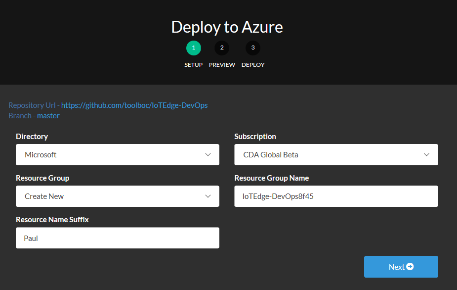

If you encounter any issues in the deployment, it is advised to delete the created Resource Group (if any) and retry with a new value for the `Resource Name Suffix` parameter.

### Step 2: Setup Visual Studio Team Services

Visual Studio Team Services (VSTS) allows for building, testing, and deploying code in an easy to manage interface.  We will build out a base for IoT Edge DevOps practices using services provided in VSTS.

If you have not already, create a new Visual Studio Team Services account [here](https://go.microsoft.com/fwlink/?LinkId=307137&clcid=0x409&wt.mc_id=o~msft~vscom~product-vsts-hero~464&campaign=o~msft~vscom~product-vsts-hero~464)

Next, create a new project and give it a descriptive name:

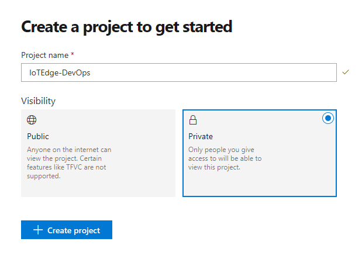

Next, select `Code` then click the `import` button underneath "import a repository" and supply this url:

    https://github.com/toolboc/IoTEdge-DevOps.git

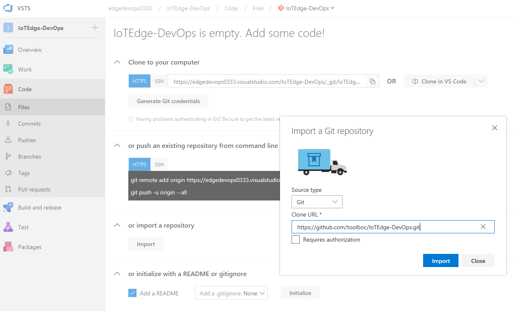

The import process should begin importing this repository into your VSTS project. 

### Step 3: Setting up Continuous Integration

This repository contains a VSTS build definition which is preconfigured to build the included EdgeSolution in [.vsts-ci.yml](/.vsts-ci.yml).  This build definition relies on two external plugins ([Replace Tokens](https://marketplace.visualstudio.com/items?itemName=qetza.replacetokens) and [Azure IoT Edge For VSTS](https://marketplace.visualstudio.com/items?itemName=vsc-iot.iot-edge-build-deploy)).  

Begin by installing the **Replace Tokens** task from the Visual Studio Marketplace by visiting this [link](https://marketplace.visualstudio.com/items?itemName=qetza.replacetoken) and clicking the "Get it free" button, then install into the organization which contains your newly created VSTS project.

Similarly, install the **Azure IoT Edge For VSTS** task from the Visual Studio Marketplace by visiting this [link](https://marketplace.visualstudio.com/items?itemName=vsc-iot.iot-edge-build-deploy) and clicking the "Get it free" button, then install into the organization which contains your newly created VSTS project.

Once these tasks are successfully installed, return to the VSTS project and select "Code" then edit the `.vsts-ci.yml` file:

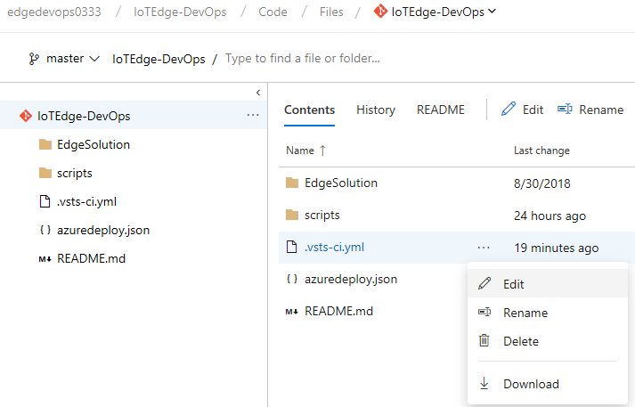

Add the following comment to the top of the file a shown below:

    # This repository is built using VSTS.

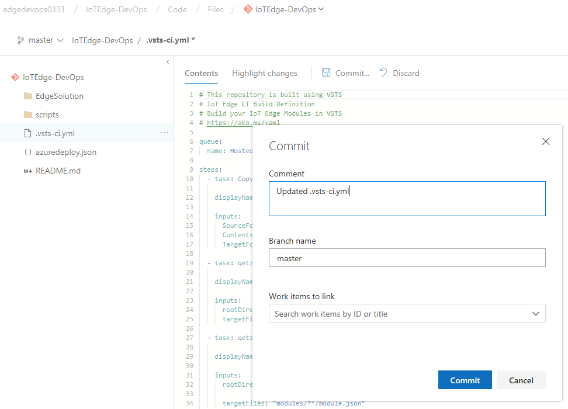

Now select "Build" and you should see that a build has kicked off upon editing the Build Definition:

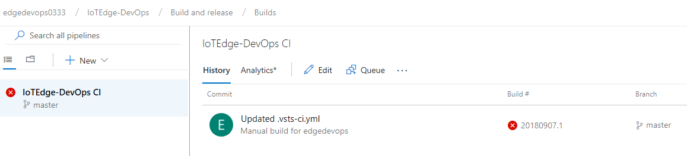

The build will fail, this is to be expected as VSTS will create the build definition with a name that contains spaces which causes a conflict in the "Azure IoT Edge - Build modules" task.

To fix this, select "Build and release" => "Builds" then edit the newly created build definition so that it does not contain spaces:

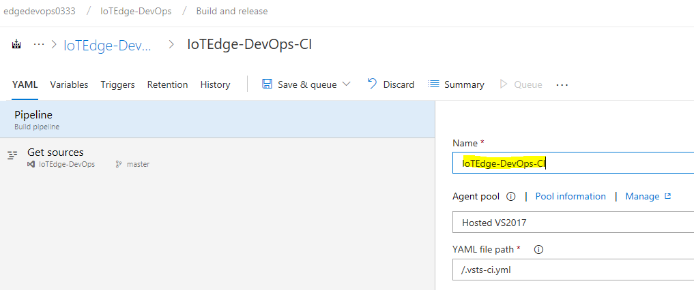

Next, we need to add a few build variables in order for the build to run successfully.  We will need to obtain the hostname of the Azure Container Registry which will be represented by `acr.host`, in addition we will need the Azure Container Registry username which will be represented by `acr.user`, and finally the Azure Container Registry password which will be represented by `acr.password`.  All of these can be obtained in the Azure portal by viewing your created Azure Container Registry and selecting
 "Access Keys" as shown below:

Next, we need to obtain the Application Insights instrumentation key which will be represented by `appinsights.instrumentationkey`.  This can be obtained in the Azure portal by viewing your created Application Insight Resource as shown below:

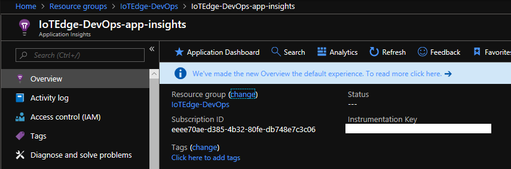

Once you have obtained all of the necessary values, create a build definition variable for `acr.host`, `acr.user`, `acr.password`, and `appinsights.instrumentationkey` as shown below:

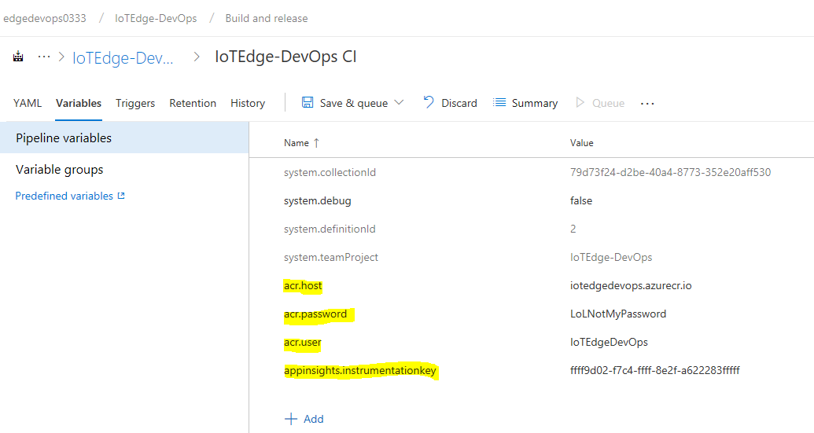

Finally, select "Save & queue" and select "Hosted Linux Preview" for the Agent Pool, then click the "Save & queue" button:

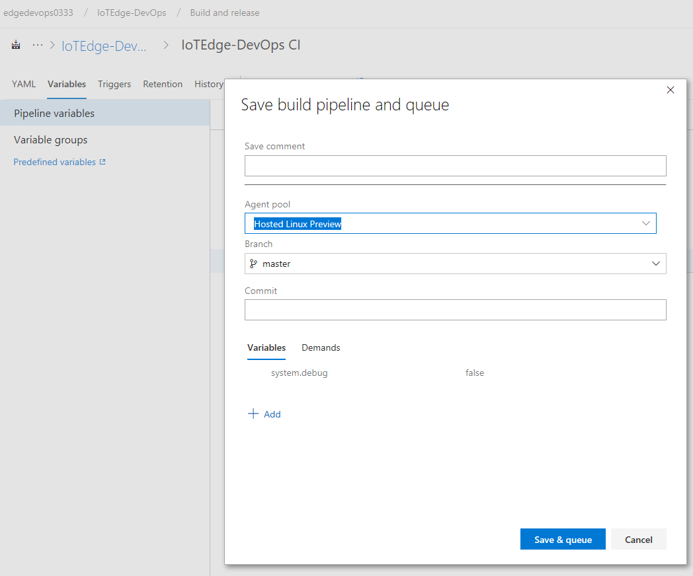

The build should complete successfully as shown below:

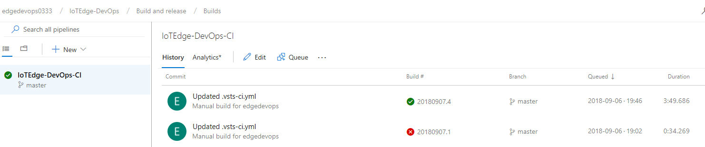

With a successful build definition in place, we can now enforce continuous integration by applying a branch policy to the master branch.  Start by selecting "Code" => "Branches" then click the "..." on the row for the master branch and select "Branch policies".

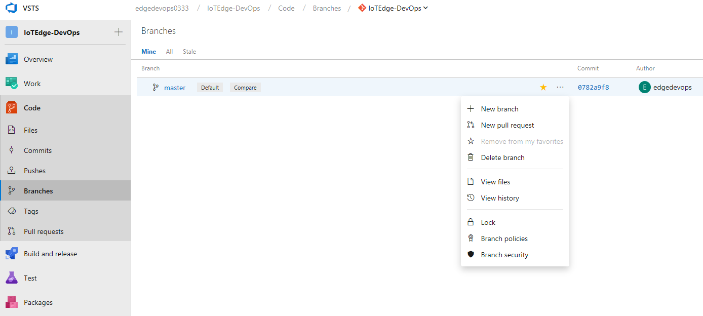

Next, under "Build validation", click "Add build policy" and select the newly created Build pipeline then click the "Save" button.

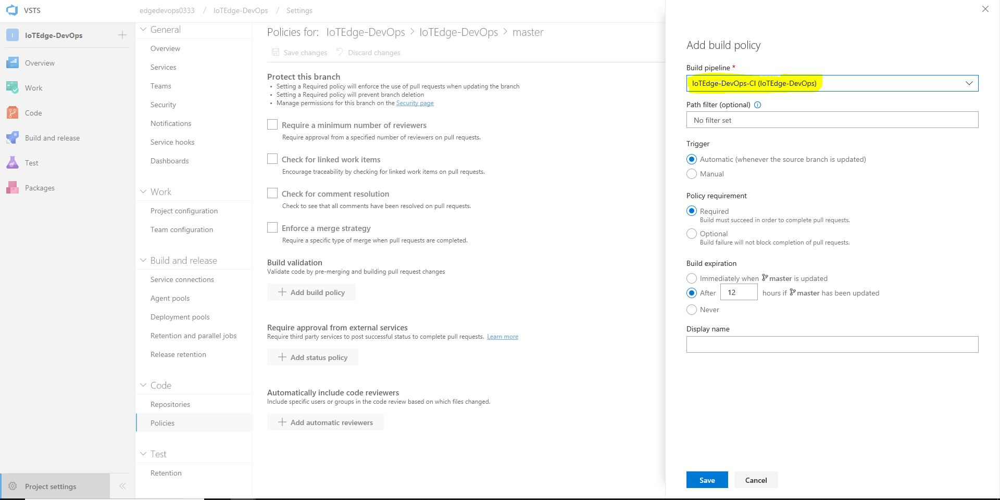

While this policy is enabled, all commits to feature branches will kick off an execution of the newly created Build pipeline and it must succeed in order for a pull request of those changes to be made to the master branch.
