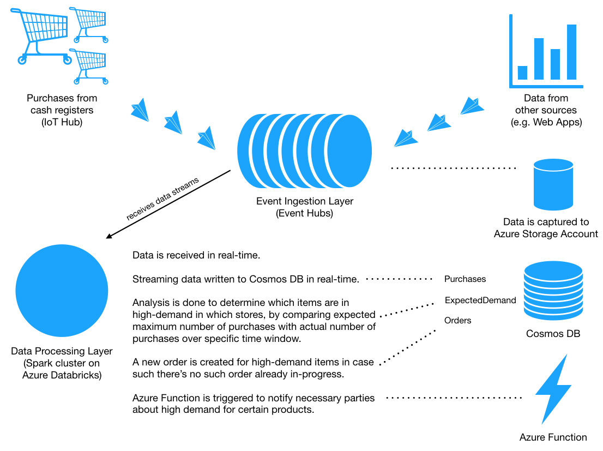

# Tailwind Traders Data Ingestion And Processing

## Architecture Diagram

The architecture below diagram provides a high-level view of solution components.



## 1. Tailwind Traders Data Ingestion Layer

### 1.1 What is data ingestion

Tailwind Traders data ingestion layer serves as a single entrypoint for all data coming from variety of source systems. In a big organization there is always more than one source data originates from: it can be purchases coming from IoT devices in stores, it can be product lookup data from web or mobile applications, it can be telemetry or system log data needed to keep technical systems healthy, and more. All the data needs to be available for consumption to many processing systems, databases, reporting and visualization tools, data analysis and machine learning systems.

### 1.2 Challenges with data ingestion

There are challenges with receiving such massive amounts of data, especially when the data is critical for decision-making. How to provide a mechanism to make sure all incoming messages are received in reliably and in order? How to make the messages available for consumption by variety of processing systems independently, at the same time, or at their own pace? How to handle incoming data in real-time?

### 1.3 Solution for data ingestion

Data ingestion system like Event Hubs can help to address these challenges. It can act as a single decoupling layer that can receive streams of data from multiple data producers and make it available for consumption by multiple independent data consumers, it stores data reliably, and is suitable for real-time workloads.

While Event Hubs is a managed service offered by Azure, users can interact with it through Apache Kafka API as Event Hubs has an option to be compatible with Apache Kafka protocol (above 1.0 protocol version).

### 1.4 Prerequisites for data ingestion

In Tailwind Traders, data about purchases is coming from numerous cash register IoT devices. To emulate the process please take a look at instructions for IoT Hub data generation [here](../DataGenerator/README.md).

### 1.5 Create a new Event Hubs namespace with an Event Hub

Because it is unlikely that IoT Hub is the single source of data in Tailwind Traders, we can benefit from Event Hubs to act as data ingestion layer for all sources of data, including IoT Hub.

[Use Azure CLI](https://docs.microsoft.com/cli/azure/install-azure-cli?WT.mc_id=MSIgniteTheTour-github-dat10) (instructions for MacOS and Linux)

```bash
export eventHubsName="<EVENT-HUBS-NAME>"
export eventHubsRegion="<EVENT-HUBS-REGION>"

az group create --name "${eventHubsName}Rg" --location $eventHubsRegion

az eventhubs namespace create \
    --resource-group "${eventHubsName}Rg" \
    --name "${eventHubsName}Ns" \
    --location $eventHubsRegion \
    --sku Standard

az eventhubs eventhub create \
    --resource-group "${eventHubsName}Rg" \
    --namespace-name "${eventHubsName}Ns" \
    --name $eventHubsName \
    --message-retention 1 \
    ---partition-count 4
```

### 1.6 Enable Data Capture

Event Hubs capture allows saving all incoming data to selected Storage Account or Azure Data Lake.

#### 1.6.1 Create a new Azure Blob Storage Account

```bash
export storageAccount="<STORAGE-ACCOUNT-NAME>"
export storageAccountRegion="<STORAGE-ACCOUNT-REGION>"
export storageAccountContainer="<STORAGE-ACCOUNT-CONTAINER-NAME>"

az group create --name "${storageAccount}Rg" --location $storageAccountRegion

az storage account create \
    --resource-group "${storageAccount}Rg" \
    --name $storageAccount \
    --sku Standard_LRS

az storage container create --name $storageAccountContainer
```

#### 1.6.2 Enable Capture

In Event Hubs instance settings, enable Event Hubs Capture to save all incoming events to the newly created Storage Account, using instructions [here](https://docs.microsoft.com/en-us/azure/event-hubs/event-hubs-capture-overview?WT.mc_id=MSIgniteTheTour-github-dat10).

### 1.7 Direct data about purchases from IoT Hub to Event Hubs

To be able to direct messages from IoT Hub to other systems, like Event Hubs or Azure Storage, it's necessary to create a custom endpoint and a route to this endpoint.

We will need IoT Hub name and resource group, as well as Event Hubs Connection String (which is available on `Shared Access Policies` page under Event Hubs namespace settings) and Subscription ID.

Event Hubs Connection String should be in the following format:

```bash
Endpoint=sb://<eventhubs-namespace>.servicebus.windows.net/;SharedAccessKeyName=<sas-key-name>;SharedAccessKey=<sas-key-value>;EntityPath=<eventhubs-name>
```

Initialize values:

```bash
export iotHubName="<IOT-HUB-NAME>"
export iotHubRg="<IOT-HUB-RESOURCE-GROUP-NAME>"
export eventHubsSubscriptionId="EVENT-HUBS-SUBSCRIPTION-ID"
export eventHubsConnectionString="EVENT-HUBS-CONNECTION-STRING"
```

#### 1.7.1 Create a new custom endpoint for Tailwind Traders Event Hubs instance

```bash
az iot hub routing-endpoint create \
    --resource-group $iotHubRg \
    --hub-name $iotHubName \
    --endpoint-name "${iotHubName}-endpoint" \
    --endpoint-type eventhub \
    --endpoint-resource-group "${eventHubsName}Rg" \
    --endpoint-subscription-id $eventHubsSubscriptionId \
    --connection-string $eventHubsConnectionString
```

#### 1.7.2 Add a new custom route to direct messages from IoT Hub to the Tailwind Traders Event Hubs endpoint

```bash
az iot hub route create \
    --resource-group $iotHubRg \
    --hub-name $iotHubName \
    --endpoint-name "${iotHubName}-endpoint" \
    --source-type DeviceMessages \
    --route-name "${iotHubName}-route" \
    --condition true \
    --enabled true
```

After both the endpoint and the route are created, all the data from cash registers coming from the IoT Hub will be directed to the specified Event Hubs instance.

## 2. Tailwind Traders Data Processing Layer

With reliable and fast data ingestion layer, Tailwind Traders is ready to receive massive amounts of data to perform real-time data analysis, stream processing, as well as react to changes in incoming events on the fly.

### 2.1 Solution for real-time data processing

Apache Spark and Azure Databricks are useful tools for data processing that offer wide range of operations on streaming data, as we will discover below.

### 2.2 Prerequisites for data-processing

#### 2.2.1 Create a new Cosmos DB instance

During data processing we will need a fast and elastic datastore for persist incoming streams of data, we will be communicating with it from code running on the Apache Spark cluster.

Create a resource group and Cosmos DB instance

```bash
export cosmosDbName="<COSMOS-DB-ACCOUNT-NAME>"
export cosmosDbRegion="<COSMOS-DB-REGION>"
export databaseName="TailwindTraders"

az group create --name "${cosmosDbName}Rg" --region $cosmosDbRegion

az cosmosdb create \
    --name $cosmosDbName \
    --kind GlobalDocumentDB \
    --resource-group "${cosmosDbName}Rg" \
    --max-interval 10 \
    --max-staleness-prefix 200
```

Create the database and necessary collections

```bash
# Create a database
az cosmosdb database create \
    --name $cosmosDbName \
    --db-name $databaseName \
    --resource-group "${cosmosDbName}Rg"

# Create a collection for storing cash register purchase data
az cosmosdb collection create \
    --collection-name "Purchases" \
    --name $cosmosDbName \
    --db-name $databaseName \
    --resource-group "${cosmosDbName}Rg"
    --partition-key-path "/PartitionId"

# Create a collection for storing expected maximum number of purchases for products
az cosmosdb collection create \
    --collection-name "ExpectedDemand" \
    --name $cosmosDbName \
    --db-name $databaseName \
    --resource-group "${cosmosDbName}Rg"

# Create a collection for storing stock refill orders for popular items
az cosmosdb collection create \
    --collection-name "RestockOrders" \
    --name $cosmosDbName \
    --db-name $databaseName \
    --resource-group "${cosmosDbName}Rg"
    --partition-key-path "/OrderId"
```

#### 2.2.2 Create a new Azure Function

Code running on Apache Spark cluster will trigger an Azure Function during data processing to notify interested parties about changes in incoming data.

```bash

# Function app and storage account names must be unique.

export azureFunctionRg="<AZURE-FUNCTION-RESOURCE-GROUP-NAME>"
export azureFunctionRegion="<AZURE-FUNCTION-REGION>"
export storageName="<AZURE-STORAGE-ACCOUNT-NAME>"
export functionAppName="<AZURE-FUNCTION-APP-NAME>"

az group create --name $azureFunctionRg --region $azureFunctionRegion

# Create a storage account for the function app
az storage account create \
  --name $storageName \
  --location $azureFunctionRegion \
  --resource-group $azureFunctionRg \
  --sku Standard_LRS

# Create a serverless function app in the resource group.
az functionapp create \
  --name $functionAppName \
  --storage-account $storageName \
  --consumption-plan-location $azureFunctionRegion \
  --resource-group $azureFunctionRg


# Go to the root directory of function code and publish function to funtion app
cd ThresholdEndpoint
func azure functionapp publish $functionAppName
  
```

Your function url will be `https://<functionappname>.azurewebsites.net/api/notification_endpoint`

### 2.3 Processing data

After all prerequisites are satisfied, we are ready to create an Apache Spark cluster in Azure Databricks.

#### 2.3.1 Create a new Azure Databricks workspace and an Apache Spark cluster

Azure Databricks workspace is required to create Apache Spark clusters.

We will need a resource group for the workspace:

```bash
export databricksRg="<AZURE-DATABRICKS-RESOURCE-GROUP-NAME>"
export databricksRegion="<AZURE-DATABRICKS-REGION>"

az group create --name $databricksRg --location $databricksRegion
```

After resource group is created, it is possible to create a new Azure Databricks workspace with either [Azure Portal](https://docs.microsoft.com/en-us/azure/azure-databricks/quickstart-create-databricks-workspace-portal?WT.mc_id=MSIgniteTheTour-github-dat10) or [Azure Resource Manager](https://docs.microsoft.com/en-us/azure/azure-databricks/quickstart-create-databricks-workspace-resource-manager-template?WT.mc_id=MSIgniteTheTour-github-dat10).

Create a new Spark cluster choosing `Scala` as a primary language and at least `3` nodes.

#### 2.3.2 Import the Notebook with data processing code

Import the Azure Databricks notebook with data processing code in Scala located [here](code/DataProcessing.dbc) (~95% FINAL, BUT CAN CHANGE) following [instructions](https://docs.azuredatabricks.net/user-guide/notebooks/notebook-manage.html#import-a-notebook?WT.mc_id=MSIgniteTheTour-github-dat10).

NOTE: The code will not work without performing steps below.

#### 2.3.3 Install Databricks CLI, create a secret store, and initialize secret values

Databricks Secret Store helps to securely manage secrets used in Azure Databricks notebooks.

Install [Databricks CLI](https://docs.databricks.com/user-guide/dev-tools/databricks-cli.html) and set up authentication with your cluster.

Create a new scope to manage secret values used throughout the notebooks:

```bash
databricks secrets create-scope --scope tailwind-traders --initial-manage-principal users
```

Create secrets for each sensitive value used in the notebook:

```bash
databricks secrets put --scope tailwind-traders --key eventhubsConnection

databricks secrets put --scope tailwind-traders --key azureFunction

databricks secrets put --scope tailwind-traders --key cosmosDbHost

databricks secrets put --scope tailwind-traders --key cosmosDbKey
```

Each of the commands above will ask for value. After editing value write `:wq!` to save changes.

You can get Cosmos DB host and primary key from `Keys` page on your Cosmos DB settings page.

Event Hubs Connection String is available on `Shared Access Policies` page under Event Hubs namespace settings, and should be in the following format:

```
Endpoint=sb://<eventhubs-namespace>.servicebus.windows.net/;SharedAccessKeyName=<sas-key-name>;SharedAccessKey=<sas-key-value>;EntityPath=<eventhubs-name>
```

Azure Function URL can be copied from your endpoint settings `</> Get function URL` link, and should look similar to:

```
https://<endpoint-name>.azurewebsites.net/api/<function-name>?code=<some-code>
```

#### 2.3.3 Add necessary libraries to the Spark cluster

Follow instructions [here](https://docs.azuredatabricks.net/user-guide/libraries.html#create-a-library?WT.mc_id=MSIgniteTheTour-github-dat10) to add following libraries to the Apache Spark cluster:

```txt
azure-eventhubs-spark_2.11-2.3.4
azure-documentdb-2.0.0
scalaj-http_2.11-2.4.1
```

Download a Spark Cosmos DB connector JAR from [here](https://search.maven.org/remotecontent?filepath=com/microsoft/azure/azure-cosmosdb-spark_2.3.0_2.11/1.2.2/azure-cosmosdb-spark_2.3.0_2.11-1.2.2-uber.jar) (direct file link) and attach the JAR to your Databricks cluster according to instructions [here](https://docs.azuredatabricks.net/spark/latest/data-sources/azure/cosmosdb-connector.html?WT.mc_id=MSIgniteTheTour-github-dat10):

```txt
azure-cosmosdb-spark_2.3.0_2.11-1.2.7-uber.jar
```

#### 2.3.4 Explore data processing code

Navigate [here](code/Walkthrough.md) to delve into details of code functionality and walk through the code step by step.

#### 2.3.5 Execute data processing code

Each code cell of the notebook can be run using `Shift+Enter` key combination allowing for interactive code execution.

## Clean up resources

```bash
az group remove --name $databricksRg
az group remove --name $azureFunctionRg
az group remove --name "${cosmosDbName}Rg"
az group remove --name "${eventHubsName}Rg"
az group remove --name $iotHubRg
```

## Thank you

For any questions about the setup or code contact [@lenadroid](https://www.twitter.com/lenadroid).
