# DEV50: Investing in Serverless: Less Servers, More Code.

Microsoft Ignite | The Tour 2018/2019 <br />
DEV50 Learning Path 1 (Building Your Applications for the Cloud) Session 5

Sometimes all you need is a few routines to run in response to a series of events – so why do you need to choose a development framework, deployment strategy and server setup for such a simple need? Wouldn’t it be great if you could just write the simple routines you need and have them run exactly when you need them and scale automatically? Turns out you can with the right cloud services.

In this talk we’ll create a set of routines that run on Azure Functions and respond to events in Azure Event Grid. We’ll then orchestrate these functions and messages using Azure Logic Apps.

Get the session presentation at [aka.ms/MyMsIgniteTheTour](http://aka.ms/MyMsIgniteTheTour).

## Features

This sample app provides the following features:

* Publishing and consuming business events with Azure Event Grid
* Leveraging Azure Functions to elastically scale on demand 
* Managing long running asynchronous processes with Durable Functions
* Integrating with third-party resources like mail and machine learning with Logic Apps

## Getting Started

The following details setup steps and requirements.

### Prerequisites

* Visual Studio 2017 (Azure Workload) or Visual Studio Code (Azure Tools Extension)
* [Storage Explorer](https://azure.microsoft.com/en-us/features/storage-explorer/?WT.mc_id=imsignitethetour-github-dev50)
* [Node.js LTS](https://nodejs.org)

### Installation

1. Create a resource group (suggested name: `tailwind-traders`)
   `az group create --location westus --name tailwind-traders`
2. Execute the command:

   `az group deployment create --name "TailwindTradersSetup" \`

   `--resource-group "tailwind-traders" \`

   `--template-file "azuredeploy.json"`
3. Copy the storage account connection string (available on the `keys` tab) to environment variable `STORAGE_CONNECTION`

   `az storage account show-connection-string -g tailwind-traders -n tailwindtradersfnstorage`
4. Copy the Event Grid Topic end point (on overview blade) to environment variable `PUBLISH_ENDPOINT`

   `az eventgrid topic show -g tailwind-traders -n inventory`
5. Copy the Event Grid key to environment variable `PUBLISH_KEY`

   `az eventgrid topic key list -n inventory -g tailwind-traders`
6. Install `artillery` with `npm install -g artillery`

### Quick start

1. Navigate to the `CLI` folder and from the root run `dotnet build`
2. Run `dotnet run init` from the same folder to populate the database and initial images
3. Publish the functions app to "tailwindtraders-inventory"  
    1. Select Existing  
    2. Run from ZIP
    3. Choose `tailwindtraders-inventory`
    4. Choose "Yes" when prompted to update the Functions runtime version
    5. Verify it is working by navigating to [http://tailwindtraders-inventory.azurewebsites.net/api/Get/2051](http://tailwindtraders-inventory.azurewebsites.net/api/Get/2051)
4. Navigate to the "tailwindtraders-inventory" functions app, wait for the functions list to expand, then click on `Monitor`
5. Click on the `Add Event Grid Subscription` link
   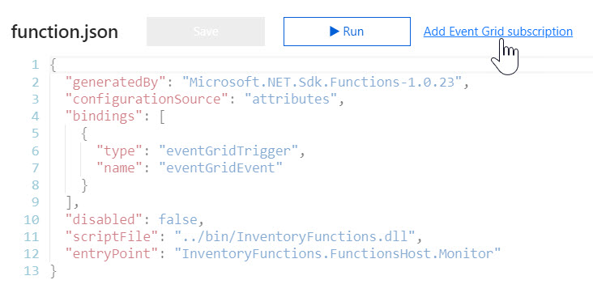
6. Subscribe to the "inventory" topic to monitor events generated by the CLI tool
   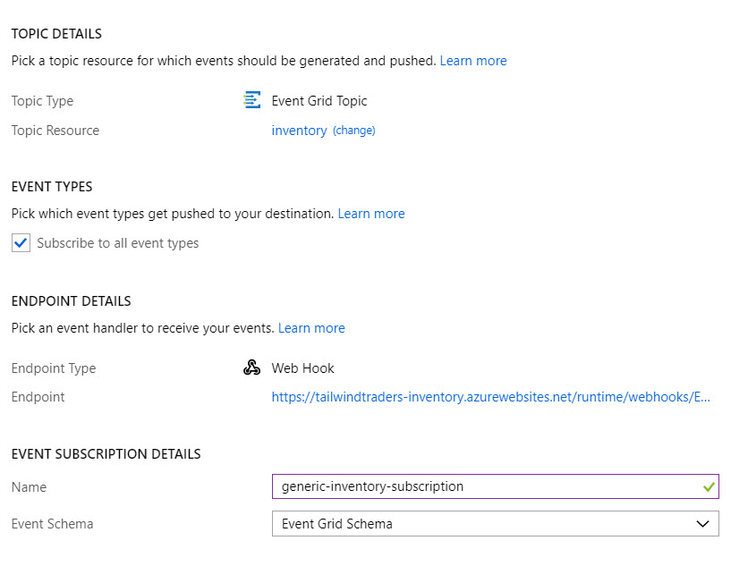
7. Repeat the subscription for the `Process` function
8. It is recommended you walk through the two logic apps steps to pre-initialize connection information. You can then delete all steps and start with a blank workflow but the connectors will then default and not re-prompt you for credentials.

> Note: be sure you had added two subscriptions to the custom event topic: one for the serverless endpoint named `Monitor` and one for the serverless endpoint named `Process`. The second subscription is required for the durable functions workflow to work.

## Demos

### First demo: serverless auto-scale

1. Open application insights and open `Live Metrics Stream.` Collapse `Outgoing Requests` and `Overall Health`
2. Navigate to the get endpoint in a new tab:  [http://tailwindtraders-inventory.azurewebsites.net/api/Get/2051](http://tailwindtraders-inventory.azurewebsites.net/api/Get/2051)
3. Show the request appear in live metrics
4. Copy the URL
5. On the command line, execute `artillery quick --count 100 -n 100 "http://tailwindtraders-inventory.azurewebsites.net/api/Get/2051"`. If, for some reason, your function endpoint is different, paste the endpoint from step (4) inside the quotes
6. Switch to the live metrics and show how it scales out
7. Open the code for the function and explain triggers and bindings

### Second demo: serverless messaging and functions

> Note: for this demo, the preferred log stream is the one scoped to the specific function endpoint. If you open the logs from the main function app tab, you will see streams for *all* functions which may be confusing to explain to the audience. If you click on the function itself, there is a tab at the bottom for logs that you can click on then expand to show it. 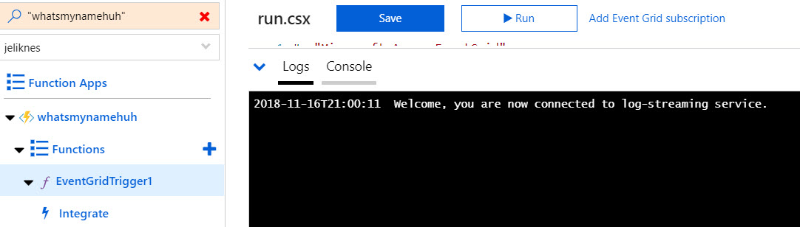

1. Open the `Monitor` function in the portal and open the live-streaming logs
2. Add a new SKU `dotnet run add 2181`
3. Show the message picked up by the function
4. Set the price for the SKU `dotnet run set-price 2181 9.99`
5. Show the same message
6. Open the code in the `Notifications` project and show how the events are raised, explain this can be done from any platform that supports an HTTPS POST
   > Note: the code will not appear in the portal because it is a compiled function. Use Visual Studio or Visual Studio Code to display the source code for the function.
7. Navigate to the subscription in the portal and show the analytics
8. Navigate to the function app and use the `Monitor` tab to show how telemetry is saved (explain it is integrated with Application Insights as well)
9. Click on the "Add Event Subscription" button and explain the subscription process

### Third demo: durable serverless workflows

1. Open storage explorer and navigate to the inventory table. Focus on the 2181 entry.
2. Execute `dotnet run get 2181` to show the CLI output, .e.g:
3. Walk through the code for `Process` (listens for events, kicks off a workflow on the `Added` event, publishes messages to the workflow for other events)
4. Walk through the code for `SkuWorkflow` and explain the tasks can come in asynchronously and the workflow will "sleep" until it is needed
5. Open the `Monitor` tab for `SkuWorkflow` in the portal and show the messages already sent from the previous demo (basically it was kicked off and received the price event)
6. Switch to the live logs for the `SkuWorkflow` function
7. Let the audience choose what order you perform steps 7-8 and 9 (image first, or description?)
8. Set a description: `dotnet run describe 2181 "A black glove."`
9. Show the notification come through
10. Finally, upload the image for the SKU: `dotnet run set-image 2181 2181.jpg`
11. Show the notification ends the workflow
12. Refresh storage explorer and show the SKU turned to active

### Fourth demo: logic apps to trigger email

1. Open the `tailwindtraders-email` logic app and click on the `Logic App Designer`
2. Choose an Event Grid Trigger to start
3. Sign in and specify the custom `inventory` topic
4. Add a custom Event Type of `Added`
   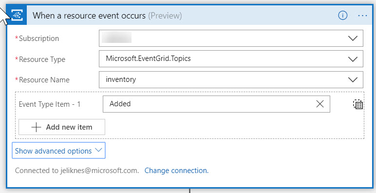
5. Add a new "Parse JSON" step
6. Pull from the event grid "data" object and specify the schema
   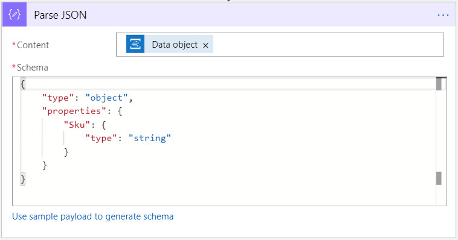

   ```json
   {
        "type": "object",
        "properties": {
            "Sku": {
                "type": "string"
            }
        }
   }

7. Add a new "Office 365 Outlook - Send Email" step
8. Authenticate and configure the email
   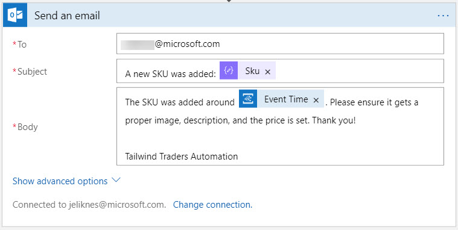
9. Save the logic app
10. Use the CLI to add a new SKU, for example: `dotnet run add 2085`
11. Verify an email arrives!

### Fifth demo: logic apps to identify images

1. Open the `tailwindtraders-captioner` logic app and click on the `Logic App Designer`
2. Choose an Event Grid Trigger to start
3. Sign in and specify the custom `inventory` topic
4. Add a custom Event Type of `ImageSet`
   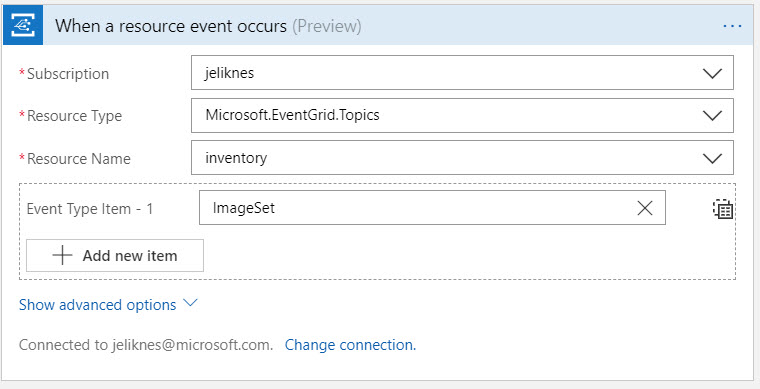
5. Add a new "Parse JSON" step
6. Pull from the event grid "data" object and specify the schema
   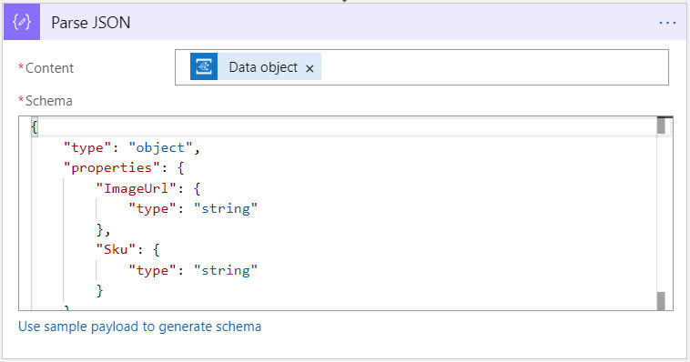

   ```json
   {
        "type": "object",
        "properties": {
            "ImageUrl": {
                "type": "string"
            },
            "Sku": {
                "type": "string"
            }
        }
   }

7. Add a new Computer Vision API step (describe image, not URL or content) and add the endpoint and keys
   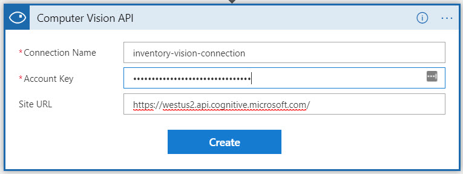
8. Choose image URL for source and specify the URL passed in the event grid event
   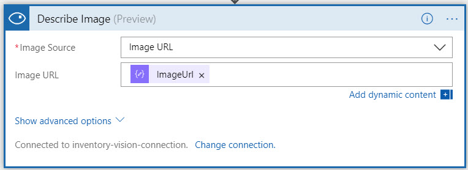
9. Choose `Azure Functions`
10. Navigate to the `MachineDescription` function
11. Add the JSON payload (SKU based on the incoming event grid payload, and description based on the Captions Caption Text)
   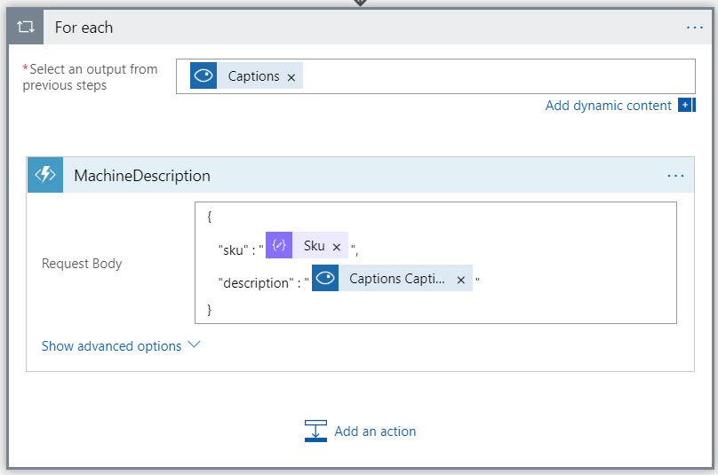
    > It's OK if you're prompted to add a for loop around the step because multiple captions may be returned.
12. Save it and use the CLI to add an image: `dotnet run set-image 2085 2085.jpg`
13. Verify the machine description is updated! (`dotnet run get 2085`)
    > This is a non-trained model. For this reason,  2085 (hammer) should property register as a tool but the others will have poor captions. That's OK ... explain this is why we have human verification and that the model can be trained on a dataset to get more accurate. Go into the logic apps history and show the list of tags and confidence levels.

## Tailwind Traders Command Line Tool

This tool is located in the `CLI` directory. Commands should be run from the root of the folder. All commands start with `dotnet run` to kick off the program.

### Initialize database

This deletes the table from table storage and repopulates it. It assumes the images for the SKUs are in the parent directory from where the command is run (the `CLI` folder). A SKU is the unique identifier of an inventory item.

`dotnet run init`

> It can take up to several minutes for the table to delete, so if you see a "Conflict... retry" loop don't worry, it should eventually continue once the table is confirmed deleted.

### Get SKU information

This retrieves information about a SKU.

`dotnet run get <sku>`

Example:

`dotnet run get 2053`

### Add a new SKU

Adds a new SKU to the database.

`dotnet run add <sku>`

> When a new SKU is added, it has no price, human-verified description or image. Subsequent commands can set these attributes. The SKU should automatically get set to `active` status after all three attributes are set.

Example:

`dotnet run add 2085`

### Set the description for a SKU

Sets the human description for a SKU (overrides any machine-generated description).

`dotnet run describe <sku> "<description>"`

Example:

`dotnet run describe 2085 "A very handy hammer."`

### Set the price of a SKU

Sets the price of the inventory item.

`dotnet run set-price <sku> <price>`

Example:

`dotnet run set-price 2085 9.99`

### Upload an image for the SKU

Uploads an image to blob storage and adds the URL of the image to the SKU.

`dotnet run set-image <sku> <image>`

> Note that `image` is expected to be in the current directory. Only the local filename is needed.

Example:

`dotnet run set-image 2085 2085.jpg`

## Teardown

To remove all resources created for this session you can delete the resource group you created earlier using the Azure CLI: 

`az group delete -n tailwind-traders`

## Resources

(Any additional resources or related projects)
