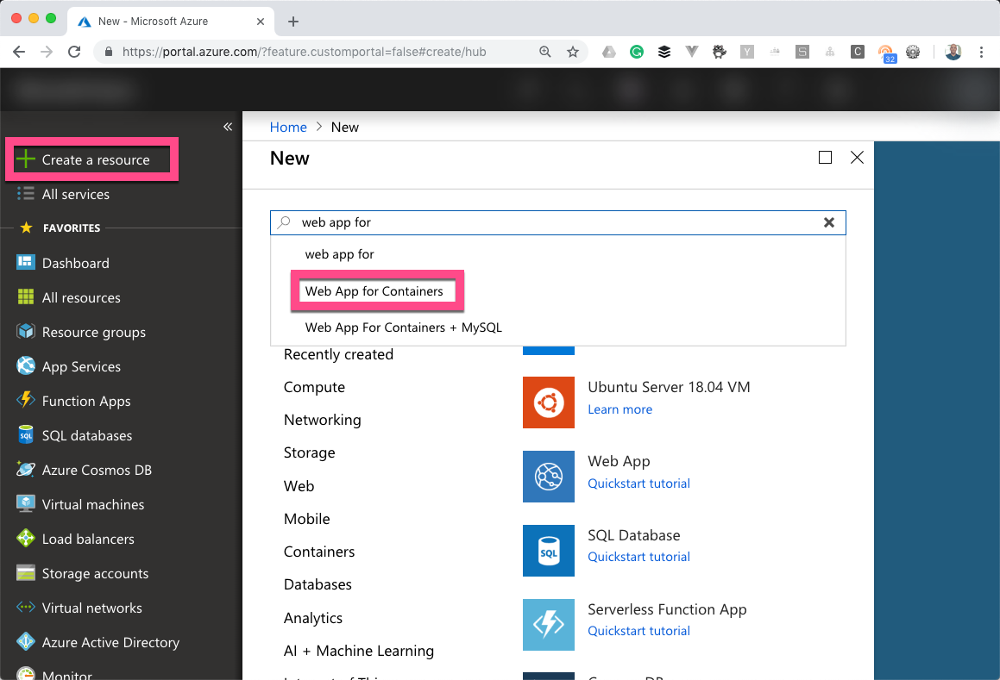
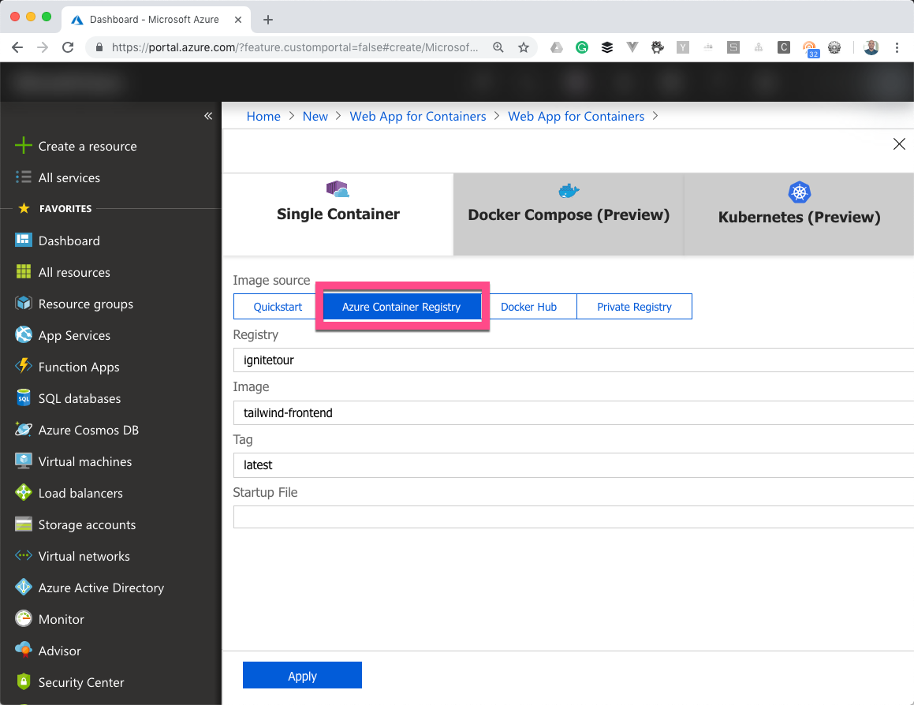

**NOTE:** This repo uses the same code as [DEV10](), so you should clone the source from [that repo](). Read down on this page for a little more info on how to setup the project in DEV10 for this session.

# Migrating Web Applications To Azure
_This project uses the exact same assets as DEV10. It focuses on deploying those assets to Azure with Azure Container Registry and Azure Web Apps for Containers._ 

[Watch A Recording](https://microsoft.sharepoint.com/:v:/t/CloudDevAdvocacy/ERBM2XpSONBFrMZmOgdXH2gBlhRw5RgVe8NEhJ49BM5vxQ?e=e6phxE)  

### What it does

Deploy 3 web-based applications (2 API's, one front end) to Azure Web Apps for Containers

[Get an Azure account](https://azure.microsoft.com/en-us/free/search/?&OCID=AID719825_SEM_AvIozCH4&lnkd=Google_Azure_Brand&gclid=Cj0KCQiAuf7fBRD7ARIsACqb8w5I_HoGm0rU-Wz1WN8LCirFrKYX0e0E-Ja3R3Dif02iigv1JF3r65caAtdhEALw_wcB)  
  
**_Deploy to Azure Button would be somewhere here, if applicable_**  

## Services Used
- [Azure Container Services](https://azure.microsoft.com/en-us/services/container-registry/?WT.mc_id=ignitetour-github-mig10)
- [Azure Web App For Containers](https://azure.microsoft.com/en-us/services/app-service/containers/?WT.mc_id=ignitetour-github-mig10)
- [Azure VNet](https://docs.microsoft.com/en-us/azure/virtual-network/virtual-networks-overview?WT.mc_id=ignitetour-github-mig10)

## How to Publish/Deploy Manually (if applicable)
  ### Prerequisites:
  - [Docker Engine Community Edition](https://www.docker.com/products/docker-engine)
  
  ### Instructions
  1. Follow the instructions in DEV10 to setup the application. Note that for this project you will need a SQL Server and Comsos DB instance that are already populated with data. To create those instances, follow the instructions... 
  1. Create a new Azure Container Registry (ACR)

      
  1. Name the registry. Create a new Resource Group if you need to. It's a good idea to keep this ACR and the web applications created later in the same Resource Group for easy cleanup so you don't incure unexpected charges.

      
  
  1. Once the registry has been created, go to the Access Keys menu item. Copy the "Login server" name and enable the admin user, setting the username and password.
  
      

  1. Open a terminal instance and login to ACR with Docker

      ```
      docker login --username <username> --password <password> <login server>
      ```
  
  1. Go the "src/frontend" directory of the DEV10 repo and build the application as a Docker image

      ```
      docker build -t [your login servername]/frontend:latest
      ```

  1. Repeat this for both "src/products-service" and "src/inventory-service"

      ```
      docker build -t [your login servername]/products-service:latest
      ```

      ```
      docker build -t [your login servername]/inventory-service:latest
      ```

  1. Push each of these images to ACR

      ```
      docker push [your login servername]/frontend:latest
      docker push [your login servername]/products-service:latest
      docker push [your login servername]/inventory-service:latest
      ```
  
  1. Create a new Web App for Containers with the Azure Portal

      

      

  1. Click on the "Configure Container" section and select "Azure Container Registry" and then select the registry that you created earlier, as well as the "frontend" container.

      

  1. Click "Apply" and then "Create" on the previous screen to finish creating the web app. View the "Overview" tab to get the URL to your service.

  1. Repeat these steps for both the products-service and inventory-service.

## Learn More/Resources

* [Use a custom Docker image for Web App for Containers](https://docs.microsoft.com/en-us/azure/app-service/containers/tutorial-custom-docker-image?WT.mc_id=ignitetour-github-mig10)


