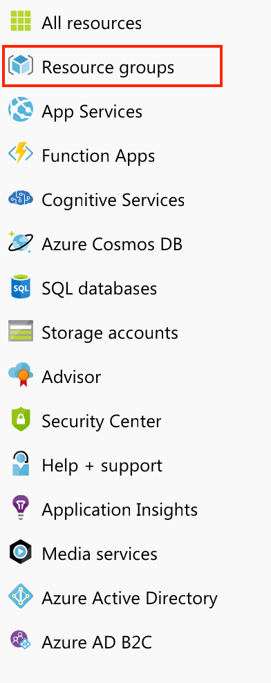
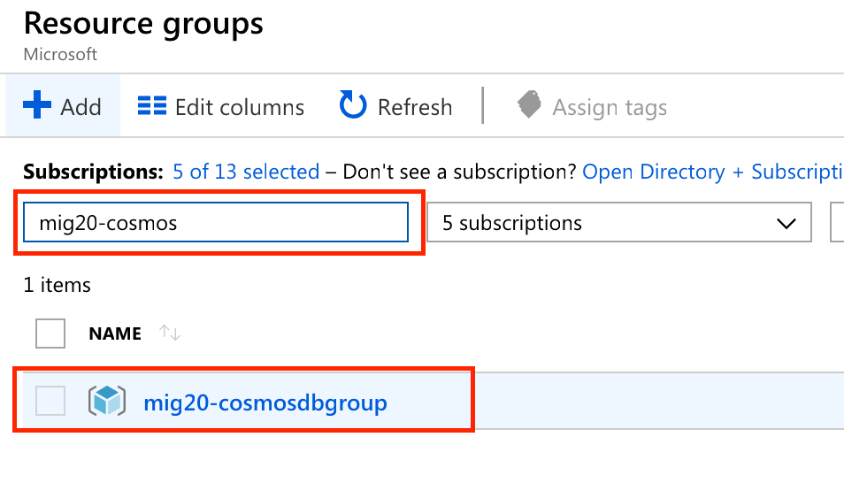
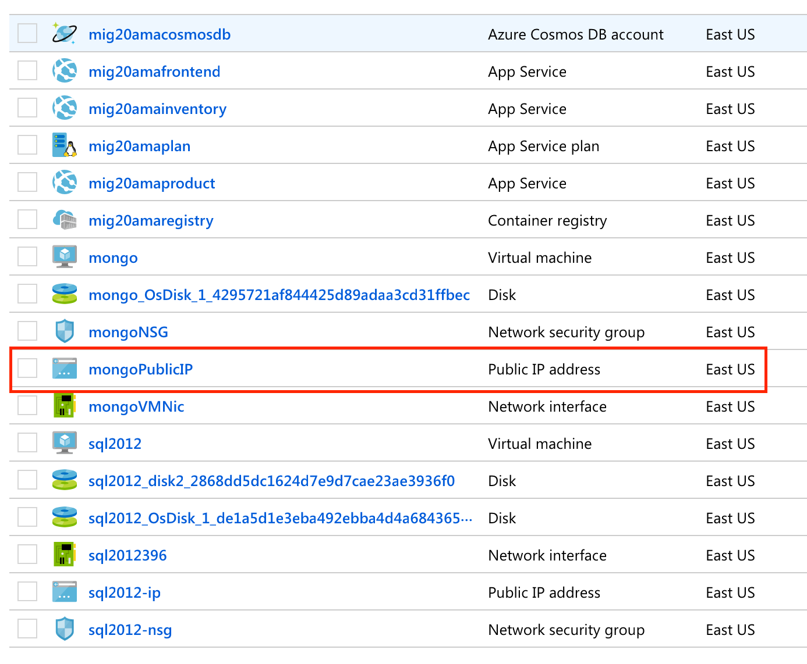
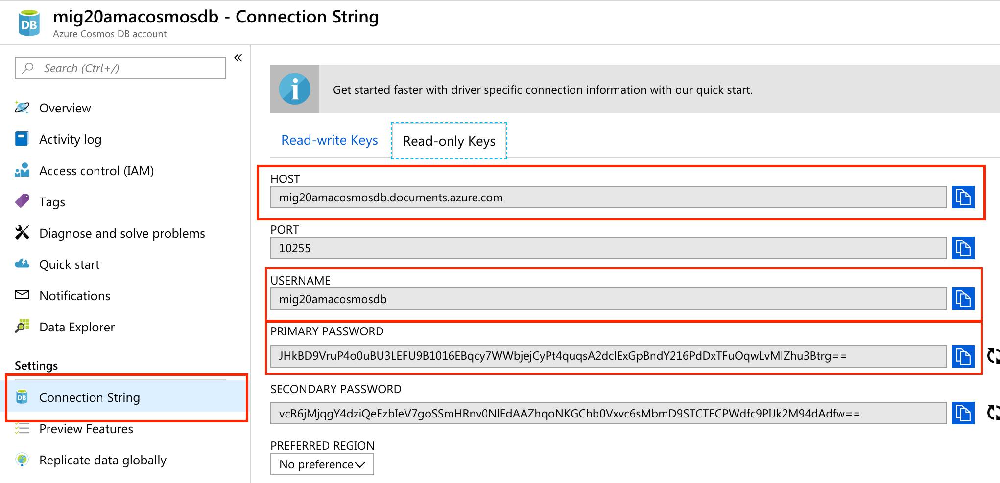
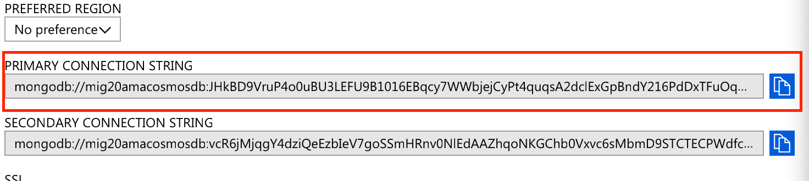
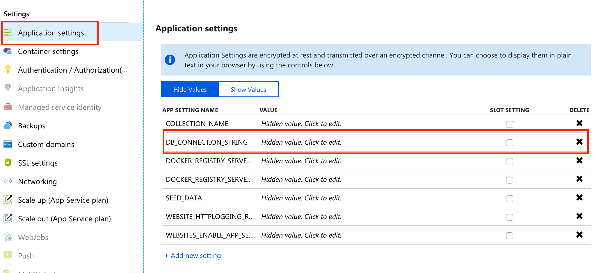
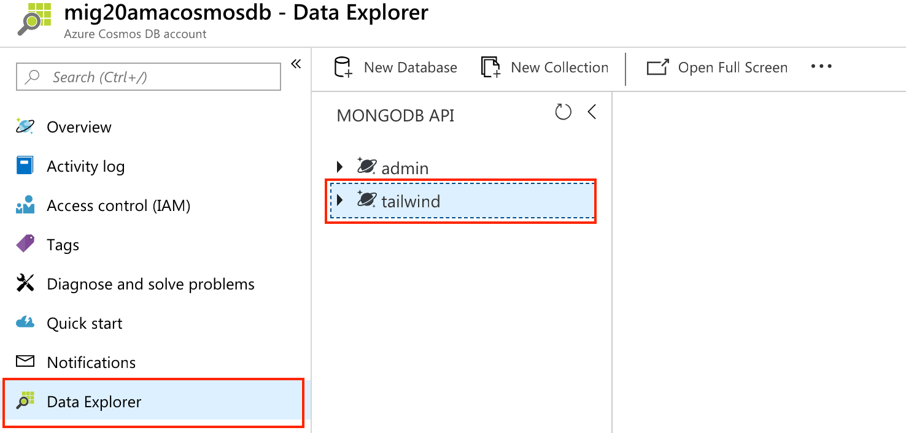
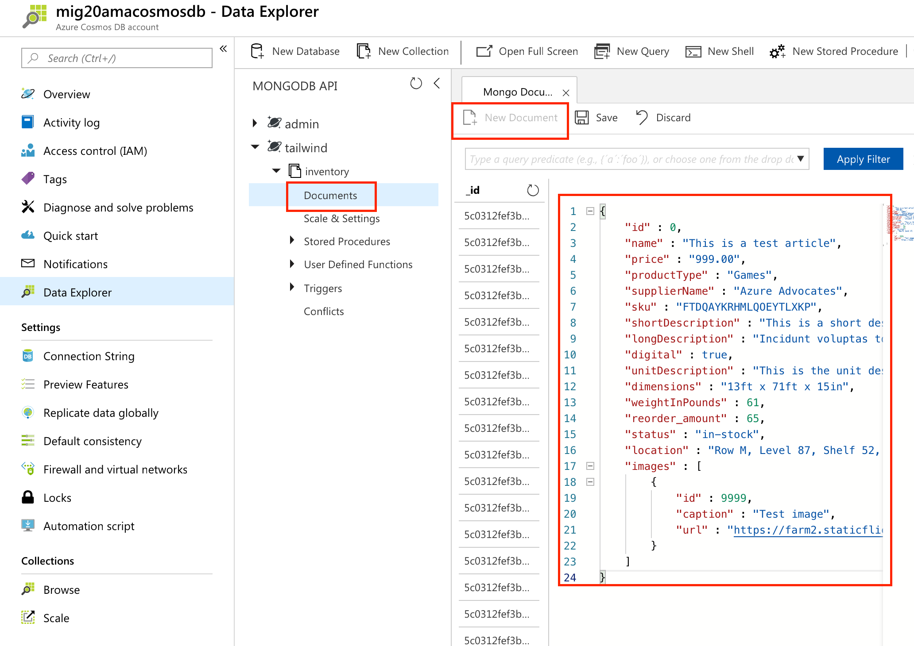
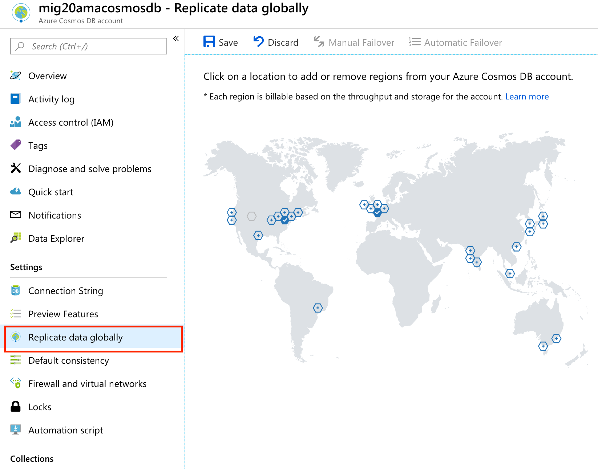

# Moving Your On-Premises Data Servers To Azure

Don't run your own datacenter - let Microsoft do it for you! Learn everything you need to know to get those SQL Server and MongoDB databases off-premises!

This README gives a guide to setting up and running all the demos contained with the _Moving Your On-Premises Data Servers To Azure_ presentation.

[Check out this full-length recording of the presentation](**https://zoom.us/recording/share/nEs92PNt82DRIBOM8QbUWZuDj00GTwlBtanVqCU73MCwIumekTziMw?startTime=1541550068000)

## Services Used

* Azure Cosmos DB (with MongoDB API)
* Azure SQL Database
* Azure SQL Data Migration Service

## Deploy the Sample Aplication

Make sure that you are logged in to an Azure subscription, then click on the button below to deploy the required resources: 

You will be prompted for the following information:

* Azure subscription to install all the resources into
* The resource group name
* A prefix to apply the name of the resources created (this helps keep the names unique across all of Azure) **make sure it's lowercase!**
* A username (to be used for all resources)
* A password (needs to be a strong password, to be used for all resources - **do not include any exclamation points or the @ character**)

The script may take up to an hour to run, it may also be faster.

<a href="https://portal.azure.com/#create/Microsoft.Template/uri/https%3A%2F%2Fraw.githubusercontent.com%2Fneilpeterson%2Fbrian-templates%2Fmaster%2Fdata-migration-template%2Fazuredeploy.json" target="_blank">
    
</a>

> **IMPORTANT** Observe the rules:
> - The SQL password may not contain the SQL username.
> - The CosmosDB password may not contain the @ character.
> - The Prefix must be in _lowercase_.

> **NOTE: POSSIBLE ERROR DURING SCRIPT**
> You may receive an error at the end of the script that looks like the following.
> 
> ```
> WARNING! Using --password via the CLI is insecure. Use --password-stdin.
> Error response from daemon: Get https://mig20realregistry.azurecr.io/v2/: unauthorized: authentication required
> Error: No such container: ignite-service
> Error response from daemon: Get https://mig20realregistry.azurecr.io/v2/tailwind-inventory-service/manifests/0.1: unauthorized: authentication required
> Unable to find image 'mig20realregistry.azurecr.io/tailwind-inventory-service:0.1' locally
> docker: Error response from daemon: Get https://mig20realregistry.azurecr.io/v2/tailwind-inventory-service/manifests/0.1: unauthorized: authentication required.
> See 'docker run --help'.
> ```
>
> This may happen because the ACR password has a `\` in it.
> To fix, take the following steps:
> 1. Type the following in the terminal: `echo $ACR_PASSWORD` and copy that value that's displayed.
> 1. Open up the `inventoryvmconfigure.sh` file. (This can be done in cloud shell by the command `code inventoryvmconfigure.sh`)
> 1. Replace the string `REPLACE_CONTAINER_REGISTRY_PASSWORD` with the password copied above, save the file and exit the text editor.
> 1. Run the following command in the terminal: `. inventorypostprocess.sh`

Once the script is finished installing, browse to the URL for the `frontend` website. The website will appear, it will take several minutes for the database to populate. Once populated, product data will appear. You will also need to set the browser to allow `unsafe scripts`, by clicking on the shield found on the right hand side of the URL bar.

### Azure Cleanup Instructions

This demo uses several expensive Azure resources. You should delete them when you're finished to save on costs.

1. Open the Azure Portal and start a new Cloud Shell session
1. (Assuming you haven't already done this) Clone this repository: `git clone https://github.com/microsoft/IgniteTheTour`
1. Change into the `MIG - Migrating Applications to the Cloud/MIG20/cleanup` directory
1. Run the `cleanup.sh` script: `./cleanup.sh`

## Demo Walkthroughs

The following are detailed walkthroughs for each of the demos in this session.

### Demo 1 - Create an Azure Cosmos DB account with Cloud Shell

Demo 1 shows how to create a new Azure Cosmos DB account using the Azure Command Line Interface (CLI) and the Cloud Shell.

The services in this demo include:

* [Azure Cosmos DB](https://docs.microsoft.com/azure/cosmos-db?WT.mc_id=msignitethetour-github-mig20)
* [Azure CLI](https://docs.microsoft.com/cli/azure?WT.mc_id=msignitethetour-github-mig20)
* [Azure Cloud Shell](https://docs.microsoft.com/en-us/azure/cloud-shell/overview?WT.mc_id=msignitethetour-github-mig20)

Follow these steps:

1. Open up the Azure portal
1. Click on the `>_` button in the toolbar, and wait for the Cloud Shell to initialize (it will take a few seconds).

1. Select `Bash` from the dropdown of the Cloud Shell window.
1. Create a _Resource Group_ to put the Azure Cosmos DB instance in. First off create 3 Bash variables:
  * Resource Group Name
  * Region to host the Azure Cosmos DB instance
  * The account name

```language-bash
RESOURCE_GROUP_COSMOS='mig20-cosmosdbgroup5'
LOCATION_COSMOS='eastus'
ACCOUNT_NAME_COSMOS='mig20cosmosdbaccount5'
```
5. Then create the _Resource Group_ itself. (A _Resource Group_ is a logical location of resources, or Azure services grouped together.)

'''language-bash
az group create --name $RESOURCE_GROUP_COSMOS --location $LOCATION_COSMOS
```

6. Then create the Azure Cosmos DB Account and place it into the resource group you just created.

```language-bash
az cosmosdb create \
    --resource-group $RESOURCE_GROUP_COSMOS \
    --name $ACCOUNT_NAME_COSMOS \
    --kind MongoDB \
    --locations regionName=eastus failoverPriority=0 isZoneRedundant=False \
    --default-consistency-level "ConsistentPrefix" \
    --enable-multiple-write-locations true
```

This will take several minutes to spin up. When it is finished (you'll see a bunch of JSON indicating it's done) you can go into the portal and click on `Resource Groups` from the left hand side.



Then you'll be able to filter by the name of the Resource Group you just created an be able to see it. Clicking into it will show you the Azure Cosmos DB account.



> If you're presenting this demo live, you should have a another Azure Comos DB account ready to go for the rest of the presentation due to the time it takes to spin it up. Use that other for the rest of the presentation.

### Demo 2 - Migrate On-Premises MongoDB to Azure Cosmos DB

Here we are moving an on-premises MongoDB (as represented in this session by an Azure Linux VM running MongoDB) to Azure Cosmos DB using native MongoDB commands.

#### Prerequistes to run the demos if on WSL (or macOS)

> In the original demo during Ignite The Tour, we used Ubuntu running on Windows Subsystem for Linux (WSL). You can use that, or you can continue to use the Cloud Shell if you like. These commands will work in either.
> If you do use Ubuntu on Windows, you will need to make sure to follow the [instructions here](https://docs.microsoft.com/en-us/cli/azure/install-azure-cli?WT.mc_id=ignitethetour-github-mig20) to install the Azure CLI.

> You will also need to install the Linux VM's RSA certificate using the following commands:
> ```language-bash
> $RESOURCE_GROUP_NAME=<WHATEVER YOU USED ABOVE>
> $MONGO_VM_NAME=mongo
> az vm user update -u azureuser --ssh-key-value "$(< ~/.ssh/id_rsa.pub)" -g $RESOURCE_GROUP_NAME -n $MONGO_VM_NAME
> ```

During this demo we will be using the native MongoDB commands:

* `mongodump` to get the data out of the source MongoDB
* `mongorestore` to get the data into Azure Cosmos DB

The steps to run the demo are below:

1. Find out the IP address of the Linux VM.
  * Go into the Azure portal
  * Click on the `Resource Groups` on the right hand menu
  * Filter by the resource group name you created during the installation, and click into it
  * Find the item called `mongoPublicIP`, click on it, and copy the element called `IP address`.
  
2. Find out the host name of the Azure Cosmos DB
  * Back in the list of resources, click on the Azure Cosmos DB account that you're using
  * Click `Connection String` on the right hand side, then copy the value from `Host`, `Username`, `Primary password`, and `Primary Connection String`
  
  
3. ssh into the Linux VM: `ssh azureuser@MONGO-IP-ADDRESS`
4. Run a mongo dump, which exports all the data to a file: `mongodump --collection inventory --db tailwind`
5. Then change into the directory that contains all dump files from the MongoDB server: `cd dump`
6. Change into the directory that contains our particular dump file: `cd tailwind`
7. Run a mongo restore:

```language-bash
mongorestore \
    --host <COSMOS HOST ADDRESS>:10255 \
    -u <COSMOS USER NAME> \
    -p <COSMOS PASSWORD> \
    --ssl \
    --sslAllowInvalidCertificates \
    inventory.bson \
    --numInsertionWorkersPerCollection 4 \
    --batchSize 24 \
    --db tailwind \
    --collection inventory
```
8. Switch the connection string to the Product Service website, so go back out to the overall Resources view and click on `<RESOURCEPREVIX>product` app service. (The `<RESOURCEPREFIX>` is the value you set during installation.)
9.Click on `Application Settings` from the right hand menu.
10. Enter the Cosmos DB `Primary Connection String` copied above into the _value_ portion for `DB_CONNECTION_STRING`. This is located in the `Application Settings` section.

11. The Product Descriptions are now coming from Cosmos DB - so let's prove that it's working by adding an item.
12. Go into your Azure Cosmos DB account and click on `Data Explorer`. Select the `tailwind` database.

13. Expland the `tailwind` node, expand the `inventory` node, and select `Documents`.
14. Click on the `New Document` button and past the JSON found in `Files\new-item.json` (in this repo), and then click `Save`.

15. View the website again, and see the item show up at the very bottom.
16. Feel free to browse the portal for Azure Cosmos DB - especially `Replicate data globally`. Click on the map and data will instantly be moved.

17. The `Metrics` tab shows how fast Azure Cosmos DB is responding.

### Demo 3 - Assess DB Migration Using the DB Migration Tool and Setup for Azure SQL Database Migration

The next portion of the session will talk about the Inventory service. The inventory service is hosted on a SQL server and served by an ASP.NET core website. The Inventory service determines the quantity of a unit that's currently in stock.

On the home page of the web site, you can see the SQL database name hosting the inventory. Whether it's the on-premises db or the new Azure SQL Database.

The on-premises database in this case is modeled by a Windows 2012/SQL 2012 virtual machine.

> **IMPORTANT** This portion can be run on Windows only!
> To run this demo you will need the Microsoft Data Migration Assistant, follow [these instructions](https://docs.microsoft.com/sql/dma/dma-overview?WT.mc_id=msignitethetour-github-mig20) to install.
> You will also need the Microsoft Data Migration Assistant.

The steps to run the demo are as follows:

#### Assessment

1. Install the Data Migration Assistant, open it up
2. Create a new project
  * Project Type: `Assessment`
  * Project Name: `tailwind`
  * Assessment type: `Database Engine`
  * Source server type: `SQL server`
  * Target server type: `Azure SQL Database`
3. Click `Next`
4. Check `Check database compatibility`
5. Check `Check feature parity`
6. Click `Next`
7. Enter the SQL 2012 server name and authentication credentials.
  * The server name can be obtained through the portal. Open up the resource view and then click on `sql2012-ip`. When that opens copy the `IP Address`. 
8. Select the `tailwind` database, click `Add`.
9. Click `Start Assessment`.

If you have time you can run both assessments, for `SQL Server feature parity` and for `Compatibility issues`.

#### Migration

We will start by migrating the schema to the new Database and then we will migrate the data.

> Migrating the schema first is needed when you migrate to an Azure SQL Database. If you choose an Azure SQL Database Managed Instance as the migration target, this step is not needed.

##### Migrating the SQL schema

1. From the portal, view all the resources for the resource group you created, and select the Azure SQL Database you created earlier.
2. Back out to the overall resources view and open the `sqldms` or the `Azure Database Migration Service`.
3. Click on `New Migration Project`
  * Project name: `tailwind`
  * Source server type: `SQL Server`
  * Target server type: `Azure SQL Database`
  * Type of activity: `Schema only migration`, Save
4. Click `Create and run activity`
5. Source Detail
  * Source SQL Server Instance Name: The IP Address you obtained above for the SQL server 2012 IP Address.
  * Authentication type: `SQL Authentication`
  * User name: the user name value created when you ran the install
  * Password: the password value created when you ran the install
  * Check `Encrypt connection`
  * Check `Trust server certificate`
  * Save
6. Select Target
  * Target server name: obtained from going into the Azure SQL Database node from all resources view and copying the `Server name` value.
  * Authentication type: `SQL Authentication`
  * User name: the user name value created when you ran the install
  * Password: the password value created when you ran the install
  * Check `Encrypt connection`
  * Click Save
7. Select `tailwind` database from the source.
8. Select the Azure SQL Database for the Target database.
9. Select `Generate for source` for Schema source.
10. Click Save.
11. Enter a name for the activity, for example `mig-schema`.
12. Click on Validation option.
13. Select Do not vaildate my database(s)
14. Click Save.
15. Click `Run migration`.

After a few moments the schema migration is complete. At this point the target database has a schema corresponding to the source, and you can now migrate the data.

> Migrating the data is very similar to what happened when Migrating the schema. You can also skip that part in the demo, or pre-save a Migration project which is already populated to be faster.

##### Migrating the data

1. From the portal, view all the resources for the resource group you created, and select the Azure SQL Database you created earlier.
2. Back out to the overall resources view and open the `sqldms` or the `Azure Database Migration Service`.
3. Open the `tailwind` project.
4. Click `New activity` and select `Offline data migration`.
5. Source Detail
  * Source SQL Server Instance Name: The IP Address you obtained above for the SQL server 2012 IP Address.
  * Authentication type: `SQL Authentication`
  * User name: the user name value created when you ran the install
  * Password: the password value created when you ran the install
  * Check `Encrypt connection`
  * Check `Trust server certificate`
  * Save
6. Select Target
  * Target server name: obtained from going into the Azure SQL Database node from all resources view and copying the `Server name` value.
  * Authentication type: `SQL Authentication`
  * User name: the user name value created when you ran the install
  * Password: the password value created when you ran the install
  * Check `Encrypt connection`
  * Click Save
7. Select `tailwind` database from the source.
8. Select the Azure SQL Database for the Target database.
9. Make sure that the table is selected and click Save.
10. Enter a name for the activity, for example `mig-data`.
11. Click on Validation option.
12. Select Do not vaildate my database(s)
13. Click Save.
14. Click `Run migration`.

### Demo 4 - Check Azure SQL Database Status and Redeploy Web App's Container

Now you can change the inventory's app settings to point at the new Azure SQL Database instance. You can find the Connection string in the Azure SQL Database portal under `Connection strings`, `ADO.NET`.

View the website to see it change.

## Learn More/Resources

* [Create an Azure Cosmos DB database built to scale](https://docs.microsoft.com/learn/modules/create-cosmos-db-for-scale/?WT.mc_id=msignitethetour-github-mig20)
* [Work with NoSQL data in Azure Cosmos DB](https://docs.microsoft.com/learn/paths/work-with-nosql-data-in-azure-cosmos-db/?WT.mc_id=msignitethetour-github-mig20)
* [Work with relational data in Azure](https://docs.microsoft.com/learn/paths/work-with-relational-data-in-azure?WT.mc_id=msignitethetour-github-mig20)
* [Secure your cloud data](https://docs.microsoft.com/learn/paths/secure-your-cloud-data?WT.mc_id=msignitethetour-github-mig20)
* [Azure migration resources](https://azure.microsoft.com/migration?WT.mc_id=msignitethetour-github-mig20)
* [Microoft Data Migration Assistant](https://docs.microsoft.com/sql/dma/dma-overview?WT.mc_id=msignitethetour-github-mig20)
* [Azure total cost of ownership calculator](https://azure.microsoft.com/pricing/tco/calculator?WT.mc_id=msignitethetour-github-mig20)
* [Microsoft Learn](https://docs.microsoft.com/learn?WT.mc_id=msignitethetour-github-mig20)
